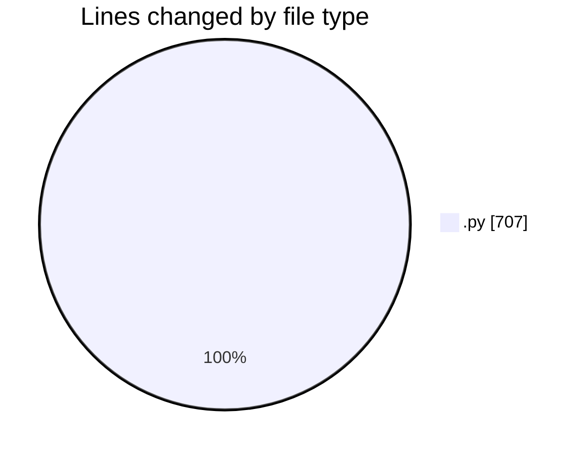
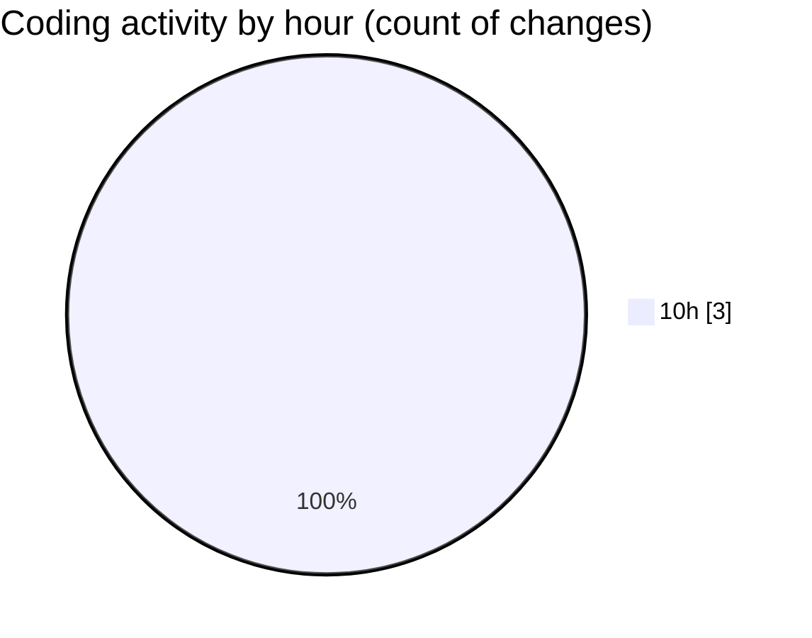

# eventscop-api-guide (Workspace) - Activity Summary 

## Overall Statistics

| Stat                   | Value                                                             |
| ---------------------- | ----------------------------------------------------------------- |
| **Lines Added** (➕)   | 707                                          |
| **Lines Removed** (➖) | 0                                        |
| **Net Change** (↕)    | 707                |
| **Active Time** (⌚)   | 2 minutes |

## Modified Files
- **schemas_base.py** (+121, -0)
- **routes.py** (+586, -0)

## Visualizations

### By File Type (Lines Changed)

### By Hour (Estimated Activity Count)

> **Last Updated:** 11/17/2025, 10:20:45 AM