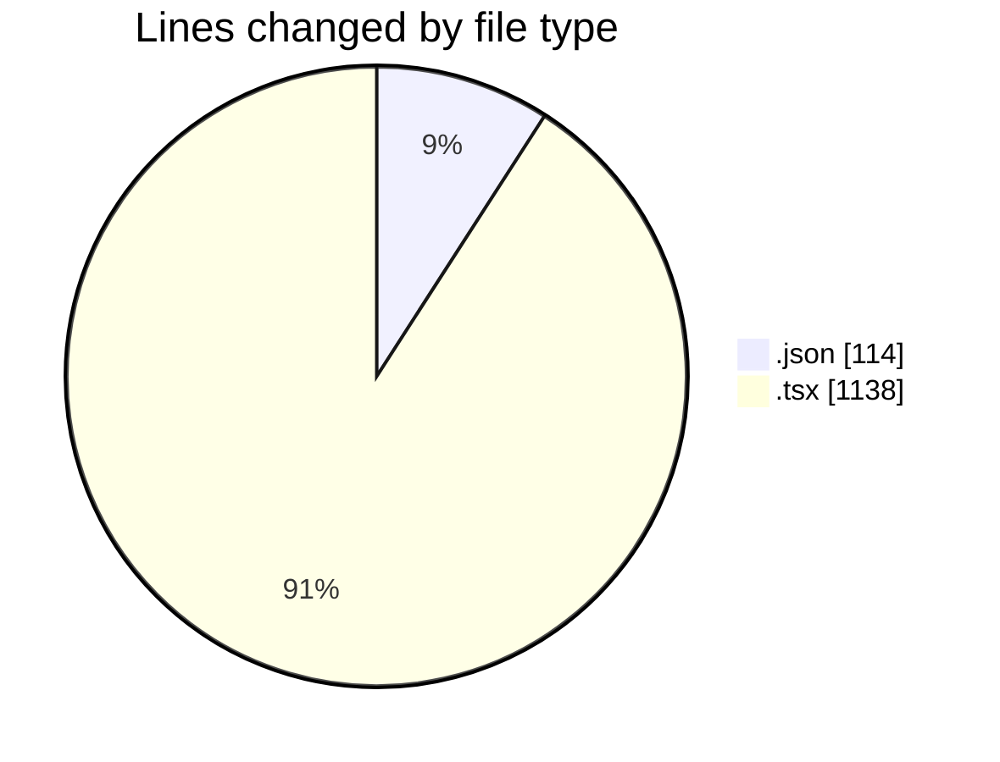
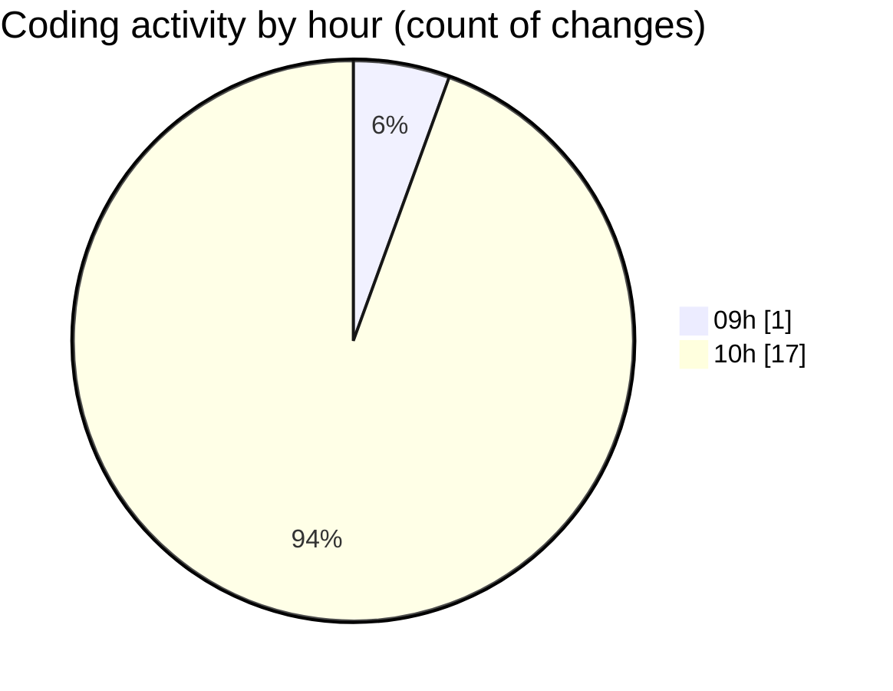

# eventscop-frontend-guide (Workspace) - Activity Summary 

## Overall Statistics

| Stat                   | Value                                                             |
| ---------------------- | ----------------------------------------------------------------- |
| **Lines Added** (➕)   | 1249                                          |
| **Lines Removed** (➖) | 3                                        |
| **Net Change** (↕)    | 1246                |
| **Active Time** (⌚)   | 26 minutes |

## Modified Files
- **package.json** (+114, -0)
- **EditorialSection.tsx** (+43, -1)
- **page.tsx** (+299, -0)
- **page.tsx** (+272, -1)
- **page.tsx** (+233, -0)
- **page.tsx** (+288, -1)

## Visualizations

### By File Type (Lines Changed)

### By Hour (Estimated Activity Count)

> **Last Updated:** 11/17/2025, 10:39:07 AM