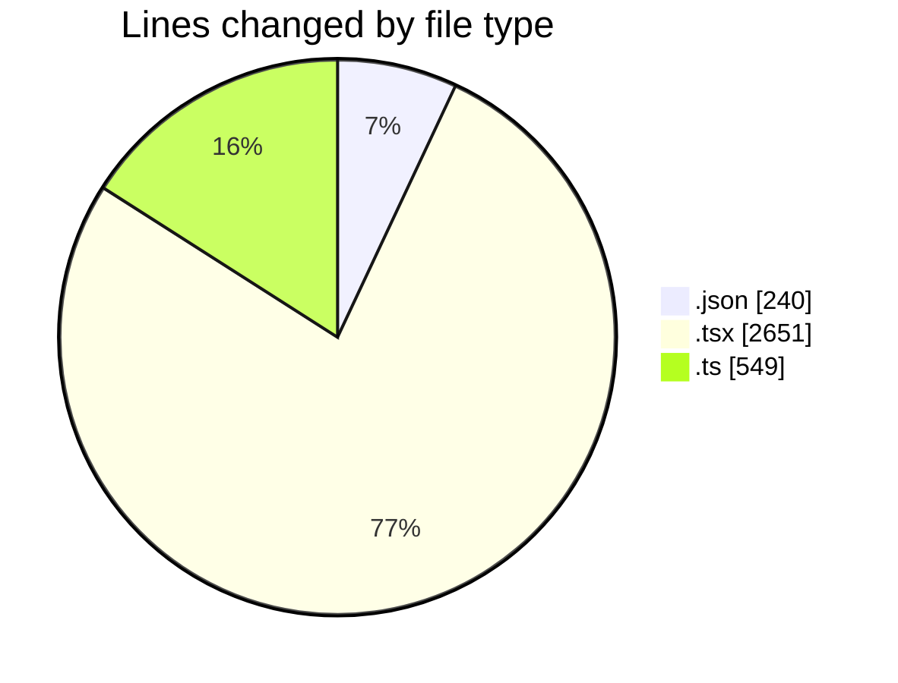
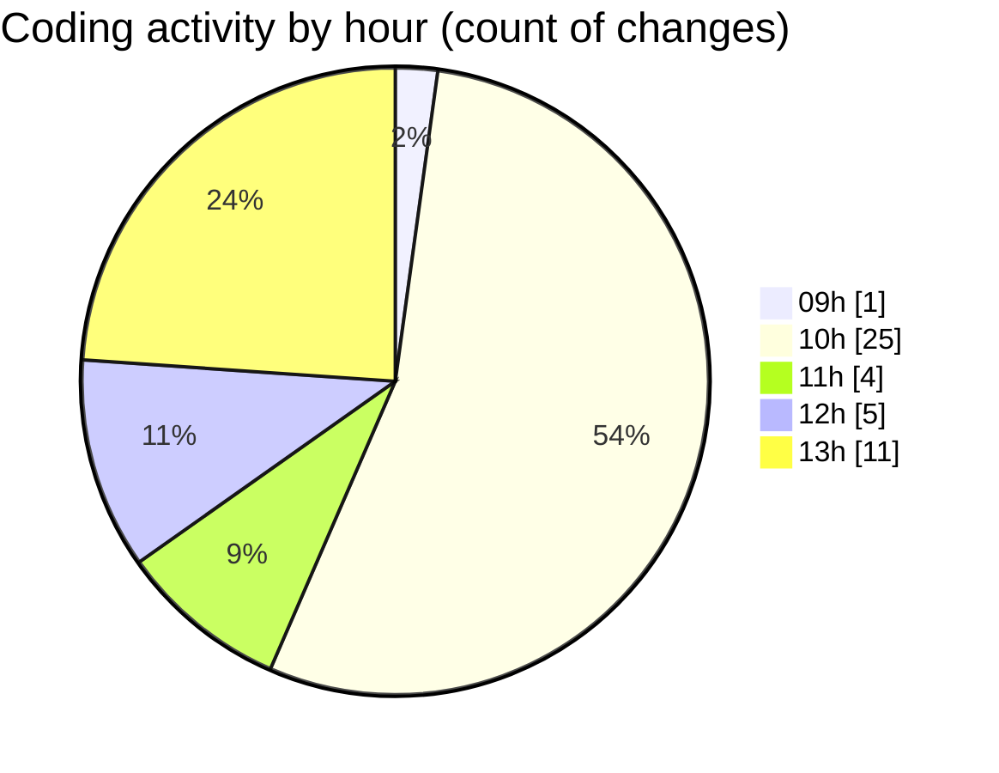

# eventscop-frontend-guide (Workspace) - Activity Summary 

## Overall Statistics

| Stat                   | Value                                                             |
| ---------------------- | ----------------------------------------------------------------- |
| **Lines Added** (➕)   | 3394                                          |
| **Lines Removed** (➖) | 46                                        |
| **Net Change** (↕)    | 3348                |
| **Active Time** (⌚)   | 51 minutes |

## Modified Files
- **package.json** (+114, -0)
- **EditorialSection.tsx** (+43, -1)
- **page.tsx** (+299, -0)
- **page.tsx** (+272, -1)
- **page.tsx** (+233, -0)
- **page.tsx** (+288, -1)
- **suppliers.ts** (+441, -0)
- **biome.json** (+125, -1)
- **page.tsx** (+180, -6)
- **page.tsx** (+183, -25)
- **HeroSection.tsx** (+45, -0)
- **PhotoGalleryBase.tsx** (+124, -0)
- **SearchPageForm.tsx** (+358, -9)
- **page.tsx** (+422, -0)
- **FiltersModal.tsx** (+75, -0)
- **useFilterContainer.ts** (+77, -0)
- **ProviderFilterContent.tsx** (+84, -2)
- **property-grid.ts** (+31, -0)

## Visualizations

### By File Type (Lines Changed)

### By Hour (Estimated Activity Count)

> **Last Updated:** 11/17/2025, 1:54:08 PM