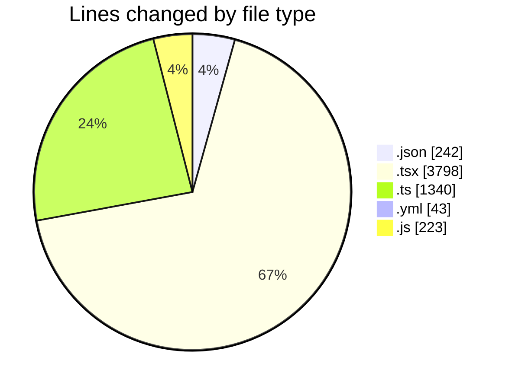
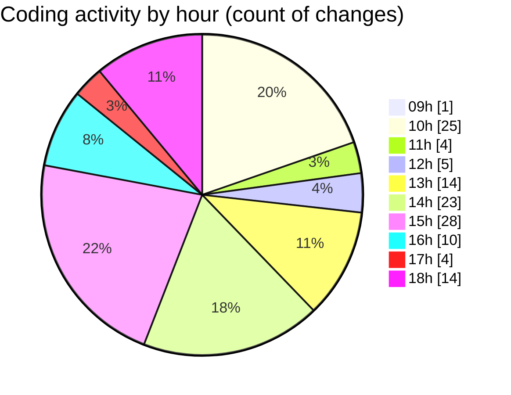

# eventscop-frontend-guide (Workspace) - Activity Summary 

## Overall Statistics

| Stat                   | Value                                                             |
| ---------------------- | ----------------------------------------------------------------- |
| **Lines Added** (➕)   | 5209                                          |
| **Lines Removed** (➖) | 437                                        |
| **Net Change** (↕)    | 4772                |
| **Active Time** (⌚)   | 201 minutes |

## Modified Files
- **package.json** (+114, -0)
- **EditorialSection.tsx** (+43, -1)
- **page.tsx** (+299, -21)
- **page.tsx** (+289, -10)
- **page.tsx** (+340, -59)
- **page.tsx** (+371, -45)
- **suppliers.ts** (+441, -0)
- **biome.json** (+126, -2)
- **page.tsx** (+194, -20)
- **page.tsx** (+242, -59)
- **HeroSection.tsx** (+45, -0)
- **PhotoGalleryBase.tsx** (+124, -0)
- **SearchPageForm.tsx** (+404, -55)
- **page.tsx** (+434, -12)
- **FiltersModal.tsx** (+75, -0)
- **useFilterContainer.ts** (+77, -0)
- **ProviderFilterContent.tsx** (+236, -138)
- **property-grid.ts** (+32, -1)
- **MobileSearchForm.tsx** (+119, -0)
- **DatesModal.tsx** (+64, -0)
- **search-filters.ts** (+87, -0)
- **ProviderFiltersContainer.tsx** (+99, -0)
- **editorial.ts** (+68, -1)
- **lefthook.yml** (+32, -11)
- **seo.ts** (+224, -0)
- **criteria-builders.ts** (+90, -0)
- **url-sync.ts** (+249, -0)
- **filter-helpers.ts** (+70, -0)
- **redirect-tests.js** (+2, -2)
- **content-tests.js** (+219, -0)

## Visualizations

### By File Type (Lines Changed)

### By Hour (Estimated Activity Count)

> **Last Updated:** 11/17/2025, 6:54:08 PM