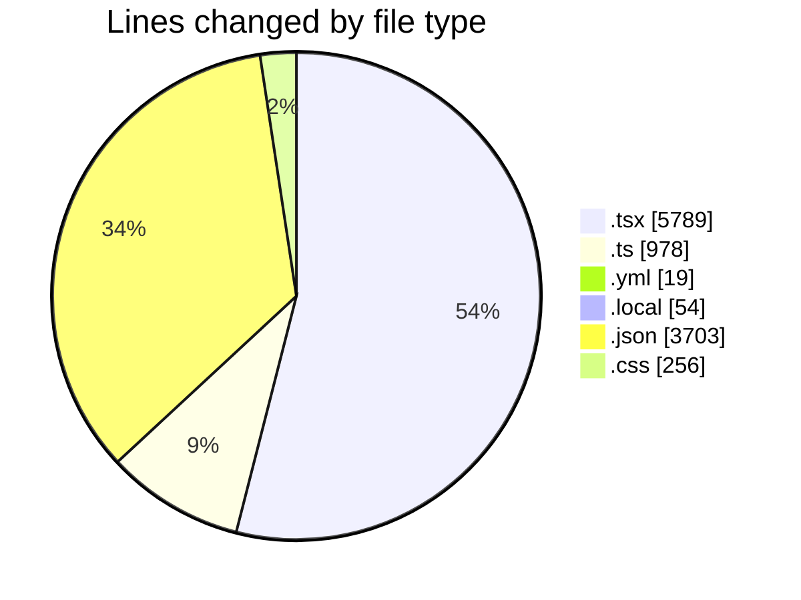
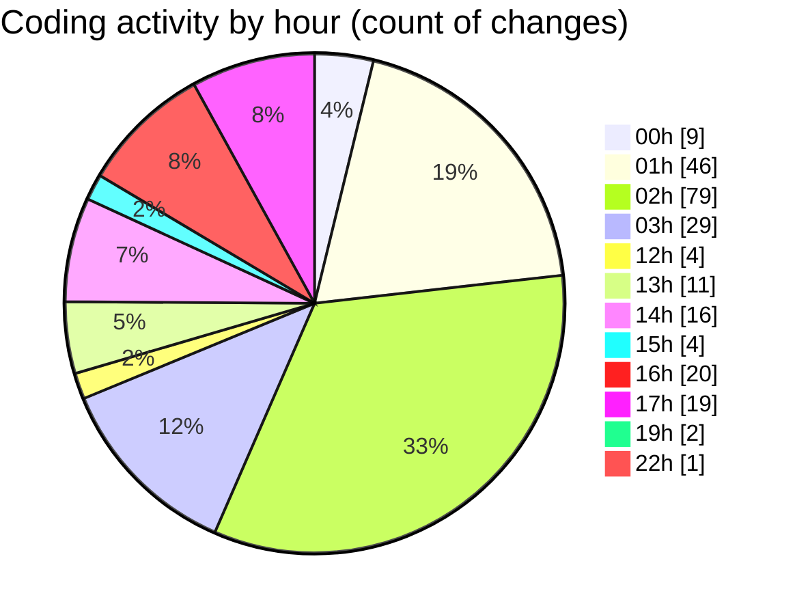

# eventscop-frontend-guide (Workspace) - Activity Summary 

## Overall Statistics

| Stat                   | Value                                                             |
| ---------------------- | ----------------------------------------------------------------- |
| **Lines Added** (➕)   | 10030                                          |
| **Lines Removed** (➖) | 769                                        |
| **Net Change** (↕)    | 9261                |
| **Active Time** (⌚)   | 307 minutes |

## Modified Files
- **page.tsx** (+259, -259)
- **DepartmentList.tsx** (+44, -10)
- **PhotoGalleryBase.tsx** (+4, -4)
- **page.tsx** (+142, -0)
- **CategoryList.tsx** (+43, -0)
- **page.tsx** (+0, -11)
- **SeoPageLayout.tsx** (+60, -0)
- **constants.ts** (+60, -1)
- **page.tsx** (+233, -0)
- **page.tsx** (+382, -0)
- **page.tsx** (+297, -0)
- **page.tsx** (+848, -63)
- **captcha.tsx** (+129, -6)
- **ActivitySuggestionsSkeleton.tsx** (+30, -0)
- **ActivityReviewsSkeleton.tsx** (+45, -0)
- **ActivityPresentationSection.tsx** (+32, -0)
- **page.tsx** (+168, -0)
- **slider.tsx** (+60, -0)
- **SuggestionCarousel.tsx** (+57, -0)
- **ImageWithOverlay.tsx** (+63, -2)
- **GeneralEntityTextBlock.tsx** (+49, -0)
- **CardCartButton.tsx** (+54, -11)
- **ActivityCard.tsx** (+148, -0)
- **PlaceCardCartButton.tsx** (+110, -68)
- **ResultsPagination.tsx** (+115, -3)
- **PlaceCardImage.tsx** (+68, -0)
- **ImageWithOverlay.tsx** (+60, -0)
- **Card.tsx** (+26, -0)
- **ReviewRatingsFields.tsx** (+94, -0)
- **carbon-footprint-calculator.tsx** (+217, -4)
- **CompareDrawer.tsx** (+109, -0)
- **StickyNavClientBase.tsx** (+65, -1)
- **MapMarker.tsx** (+79, -1)
- **LocationTabsContent.tsx** (+323, -1)
- **useDateChangeReset.ts** (+90, -1)
- **CapacitySection.tsx** (+32, -0)
- **lefthook.yml** (+10, -9)
- **field.tsx** (+233, -0)
- **next.config.ts** (+222, -54)
- **instrumentation.ts** (+35, -1)
- **posthog-server.ts** (+28, -5)
- **.env.local** (+53, -1)
- **instrumentation-client.ts** (+22, -4)
- **locations.ts** (+5, -4)
- **footer.ts** (+125, -4)
- **fr.json** (+1845, -59)
- **de.json** (+1772, -27)
- **OrganizeSection.tsx** (+63, -1)
- **ExpertCard.tsx** (+279, -145)
- **globals.css** (+255, -1)
- **layout.tsx** (+179, -0)
- **common.ts** (+291, -8)
- **participantsSchema.ts** (+18, -0)

## Visualizations

### By File Type (Lines Changed)

### By Hour (Estimated Activity Count)

> **Last Updated:** 11/18/2025, 10:19:16 PM