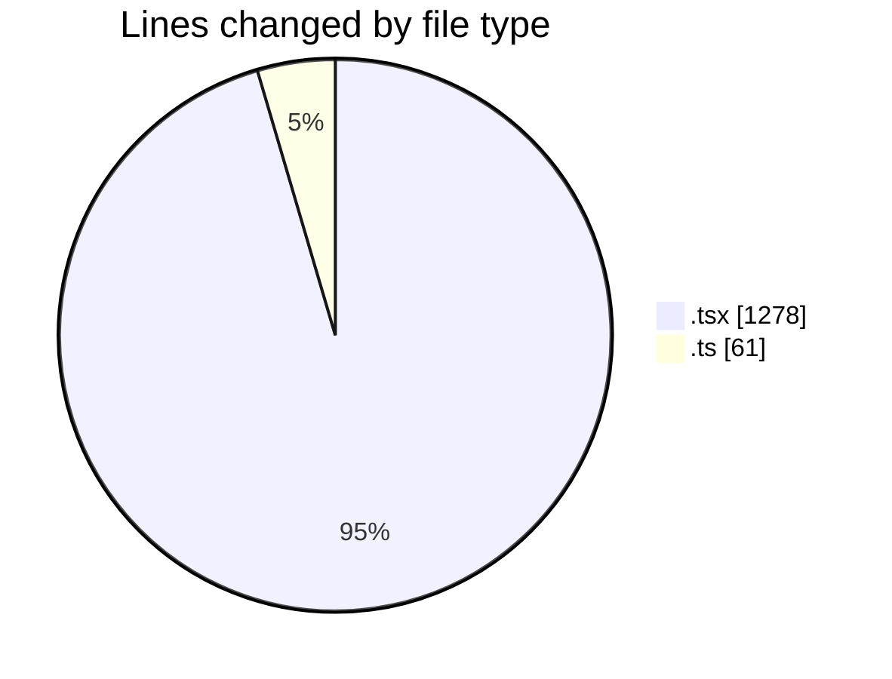
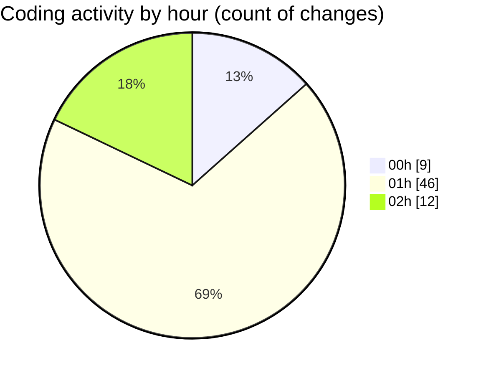

# eventscop-frontend-guide (Workspace) - Activity Summary 

## Overall Statistics

| Stat                   | Value                                                             |
| ---------------------- | ----------------------------------------------------------------- |
| **Lines Added** (➕)   | 1123                                          |
| **Lines Removed** (➖) | 216                                        |
| **Net Change** (↕)    | 907                |
| **Active Time** (⌚)   | 95 minutes |

## Modified Files
- **page.tsx** (+168, -201)
- **DepartmentList.tsx** (+39, -3)
- **PhotoGalleryBase.tsx** (+2, -0)
- **page.tsx** (+142, -0)
- **CategoryList.tsx** (+43, -0)
- **page.tsx** (+0, -11)
- **SeoPageLayout.tsx** (+60, -0)
- **constants.ts** (+60, -1)
- **page.tsx** (+233, -0)
- **page.tsx** (+376, -0)

## Visualizations

### By File Type (Lines Changed)

### By Hour (Estimated Activity Count)

> **Last Updated:** 11/18/2025, 2:04:09 AM