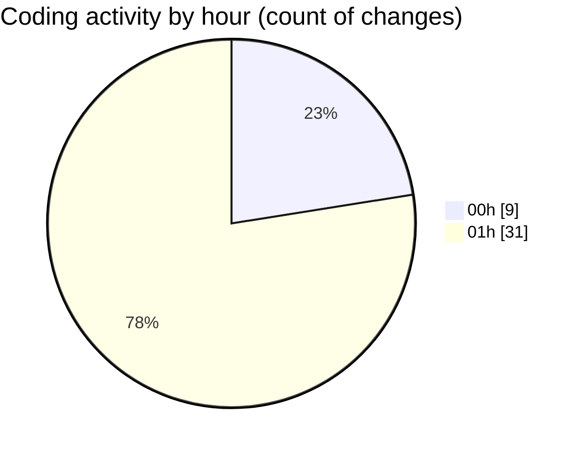

# eventscop-frontend-guide (Workspace) - Activity Summary 

## Overall Statistics

| Stat                   | Value                                                             |
| ---------------------- | ----------------------------------------------------------------- |
| **Lines Added** (➕)   | 396                                          |
| **Lines Removed** (➖) | 110                                        |
| **Net Change** (↕)    | 286                |
| **Active Time** (⌚)   | 59 minutes |

## Modified Files
- **page.tsx** (+50, -96)
- **DepartmentList.tsx** (+39, -3)
- **PhotoGalleryBase.tsx** (+2, -0)
- **page.tsx** (+142, -0)
- **CategoryList.tsx** (+43, -0)
- **page.tsx** (+0, -11)
- **SeoPageLayout.tsx** (+60, -0)
- **constants.ts** (+60, -0)

## Visualizations

### By File Type (Lines Changed)

### By Hour (Estimated Activity Count)

> **Last Updated:** 11/18/2025, 1:49:09 AM