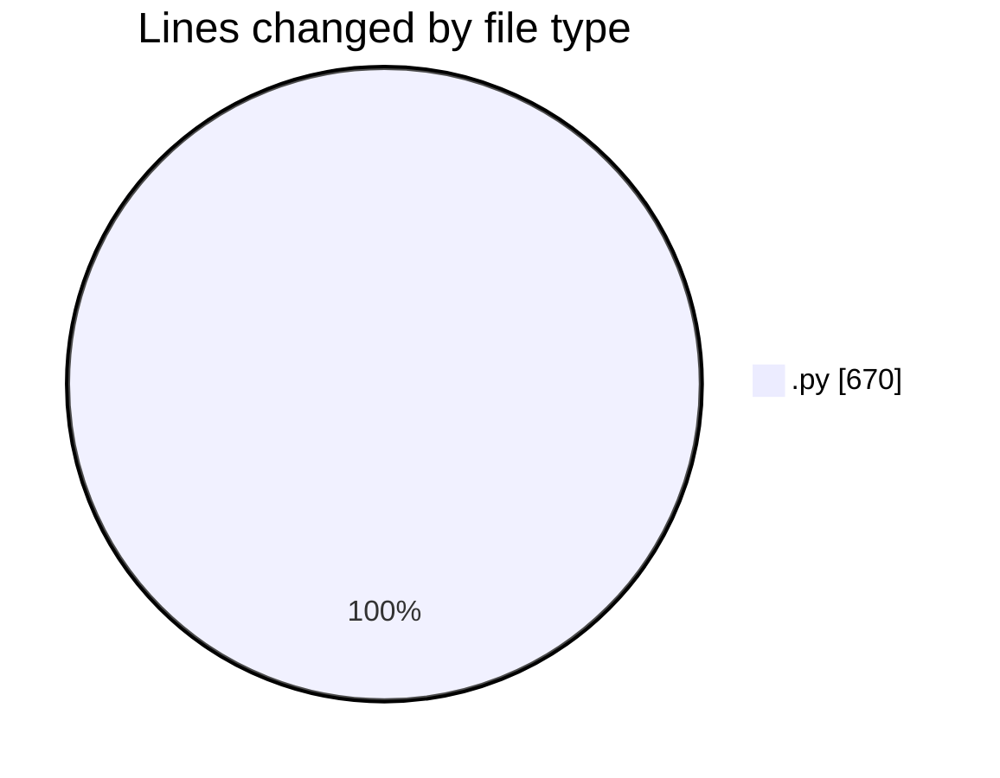
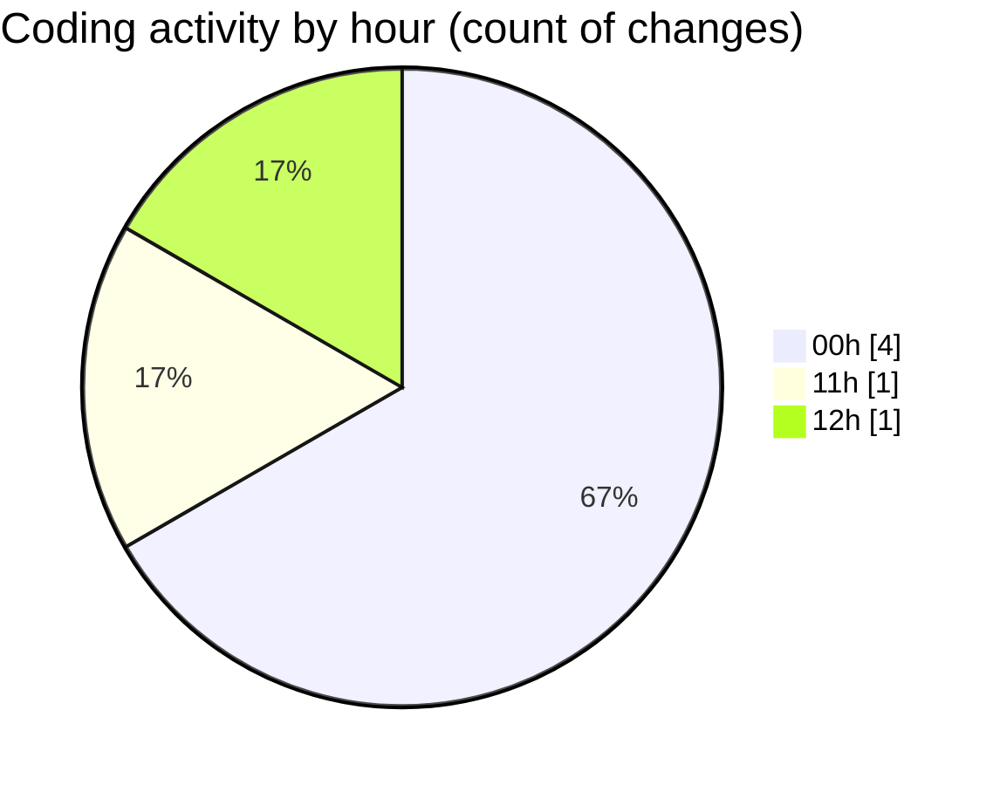

# eventscop-api-guide (Workspace) - Activity Summary 

## Overall Statistics

| Stat                   | Value                                                             |
| ---------------------- | ----------------------------------------------------------------- |
| **Lines Added** (➕)   | 670                                          |
| **Lines Removed** (➖) | 0                                        |
| **Net Change** (↕)    | 670                |
| **Active Time** (⌚)   | 2 minutes |

## Modified Files
- **71cc700a5867_add_trad.py** (+291, -0)
- **routes.py** (+379, -0)

## Visualizations

### By File Type (Lines Changed)

### By Hour (Estimated Activity Count)

> **Last Updated:** 11/19/2025, 12:25:57 PM