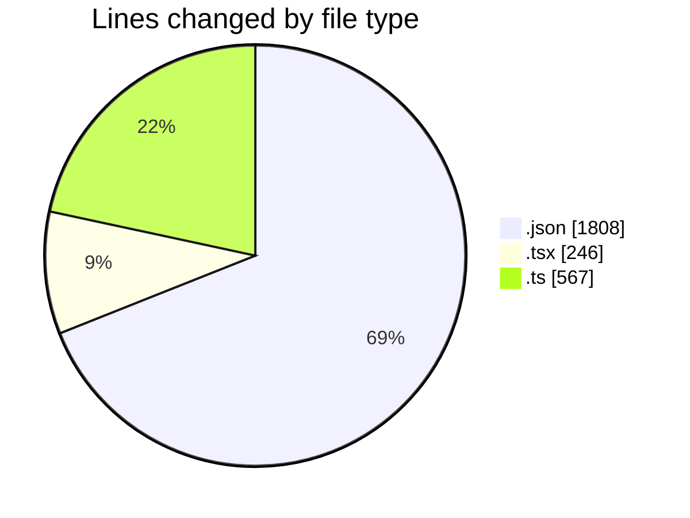
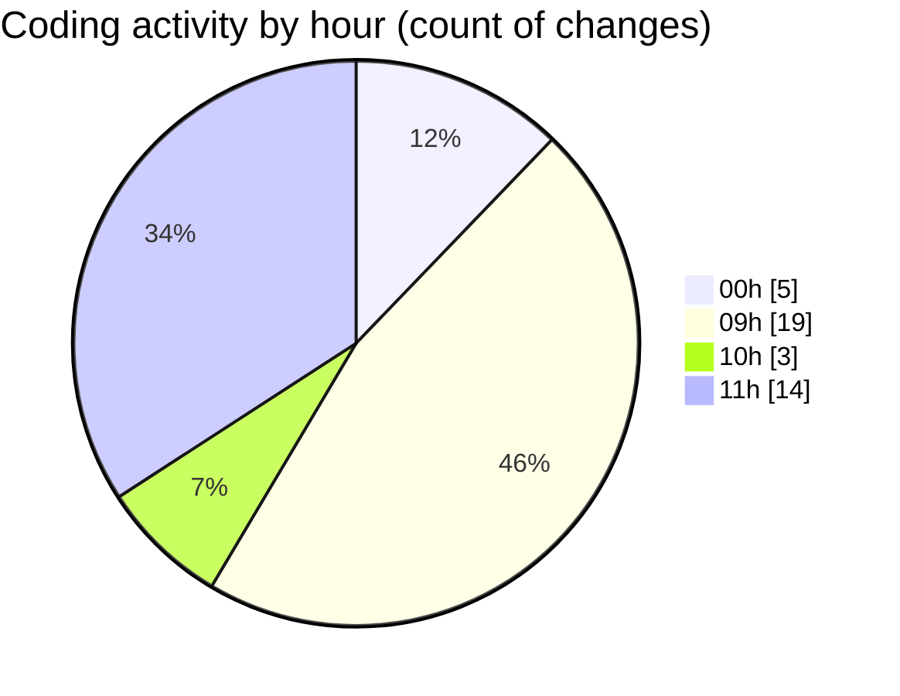

# eventscop-frontend-guide (Workspace) - Activity Summary 

## Overall Statistics

| Stat                   | Value                                                             |
| ---------------------- | ----------------------------------------------------------------- |
| **Lines Added** (➕)   | 2490                                          |
| **Lines Removed** (➖) | 131                                        |
| **Net Change** (↕)    | 2359                |
| **Active Time** (⌚)   | 38 minutes |

## Modified Files
- **en.json** (+1771, -18)
- **NumericInput.tsx** (+0, -12)
- **participantsSchema.ts** (+2, -4)
- **BriefBudgetField.tsx** (+35, -1)
- **OrganizeSection.tsx** (+1, -2)
- **ui-components.ts** (+9, -21)
- **StepParticipants.tsx** (+8, -0)
- **common.ts** (+8, -8)
- **fr.json** (+0, -19)
- **ExpertCard.tsx** (+9, -37)
- **layout.tsx** (+0, -9)
- **supplier.ts** (+515, -0)
- **ProviderQuoteSidebar.tsx** (+41, -0)
- **SidebarWrapper.tsx** (+26, -0)
- **PlaceQuoteSidebar.tsx** (+65, -0)

## Visualizations

### By File Type (Lines Changed)

### By Hour (Estimated Activity Count)

> **Last Updated:** 11/19/2025, 11:29:19 AM