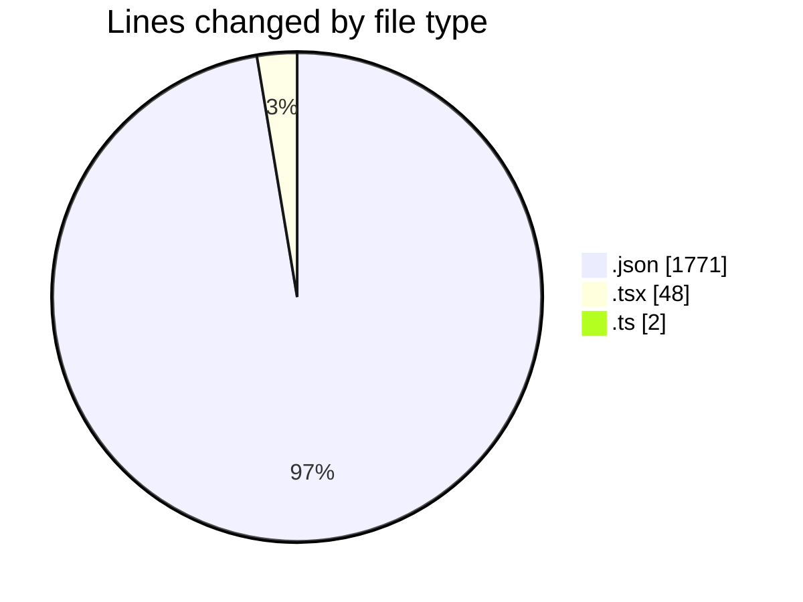
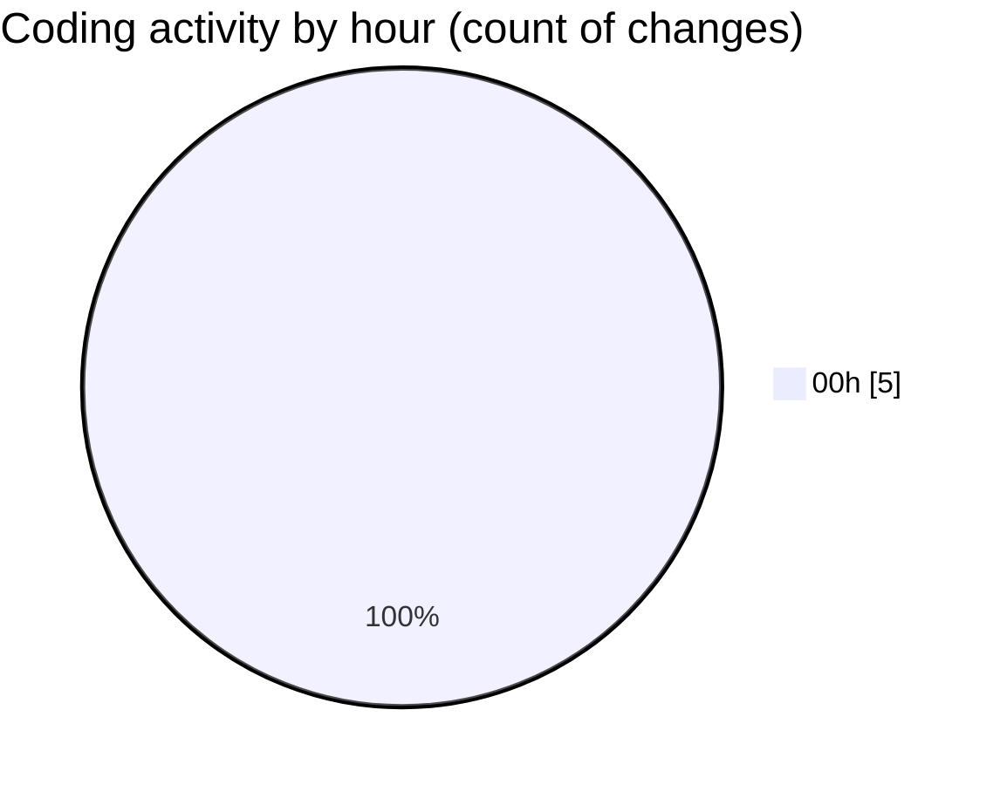

# eventscop-frontend-guide (Workspace) - Activity Summary 

## Overall Statistics

| Stat                   | Value                                                             |
| ---------------------- | ----------------------------------------------------------------- |
| **Lines Added** (➕)   | 1808                                          |
| **Lines Removed** (➖) | 13                                        |
| **Net Change** (↕)    | 1795                |
| **Active Time** (⌚)   | 3 minutes |

## Modified Files
- **en.json** (+1771, -0)
- **NumericInput.tsx** (+0, -12)
- **participantsSchema.ts** (+2, -0)
- **BriefBudgetField.tsx** (+35, -1)

## Visualizations

### By File Type (Lines Changed)

### By Hour (Estimated Activity Count)

> **Last Updated:** 11/19/2025, 12:34:16 AM