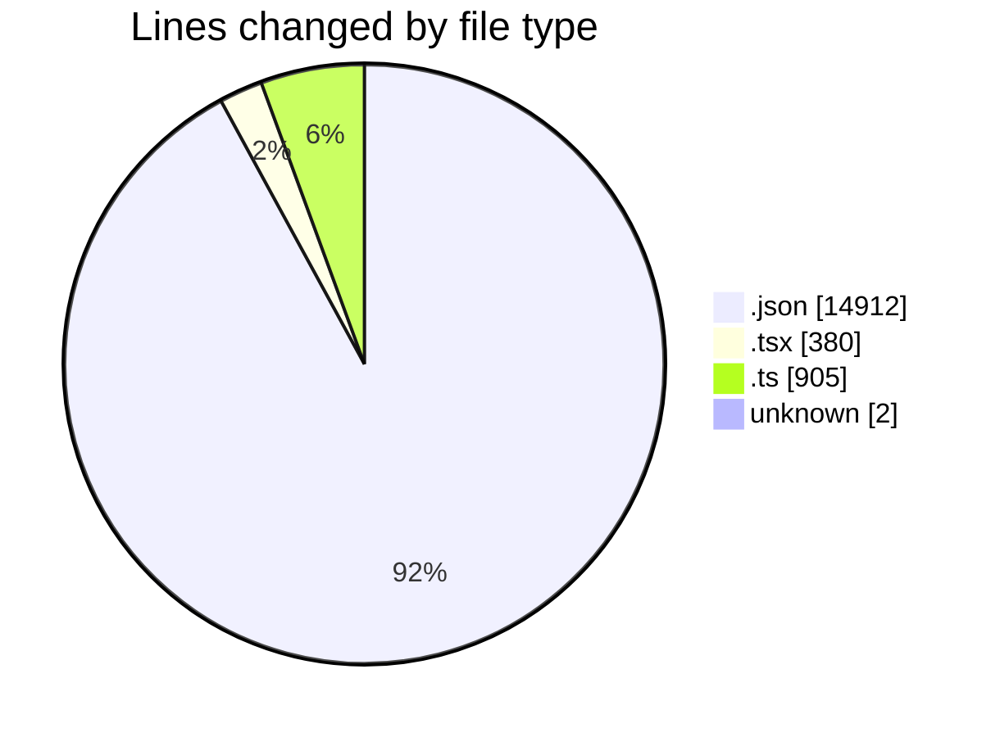
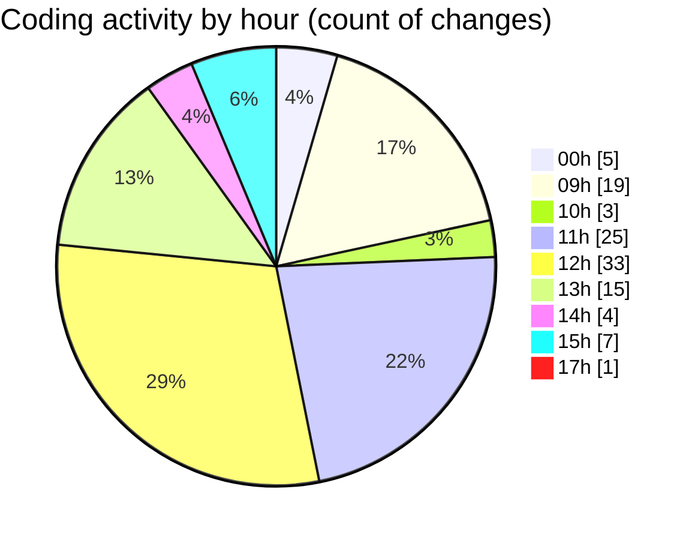

# eventscop-frontend-guide (Workspace) - Activity Summary 

## Overall Statistics

| Stat                   | Value                                                             |
| ---------------------- | ----------------------------------------------------------------- |
| **Lines Added** (➕)   | 15941                                          |
| **Lines Removed** (➖) | 258                                        |
| **Net Change** (↕)    | 15683                |
| **Active Time** (⌚)   | 126 minutes |

## Modified Files
- **en.json** (+1794, -18)
- **NumericInput.tsx** (+0, -17)
- **participantsSchema.ts** (+2, -4)
- **BriefBudgetField.tsx** (+35, -1)
- **OrganizeSection.tsx** (+1, -2)
- **ui-components.ts** (+9, -21)
- **StepParticipants.tsx** (+8, -0)
- **common.ts** (+8, -8)
- **fr.json** (+3835, -22)
- **ExpertCard.tsx** (+9, -37)
- **layout.tsx** (+0, -9)
- **supplier.ts** (+515, -1)
- **ProviderQuoteSidebar.tsx** (+41, -5)
- **SidebarWrapper.tsx** (+26, -13)
- **PlaceQuoteSidebar.tsx** (+65, -3)
- **QuoteDrawer.tsx** (+58, -7)
- **ActivityQuoteSidebar.tsx** (+31, -4)
- **page.tsx** (+4, -4)
- **COMMIT_EDITMSG** (+2, -0)
- **cateringSchema.ts** (+97, -33)
- **teamBuildingSchema.ts** (+82, -24)
- **ar.json** (+1773, -23)
- **de.json** (+35, -0)
- **ru.json** (+1773, -0)
- **es.json** (+1780, -0)
- **it.json** (+1780, -0)
- **cn.json** (+1768, -0)
- **settings.json** (+306, -0)
- **package.json** (+3, -2)
- **route.ts** (+101, -0)

## Visualizations

### By File Type (Lines Changed)

### By Hour (Estimated Activity Count)

> **Last Updated:** 11/19/2025, 5:57:17 PM