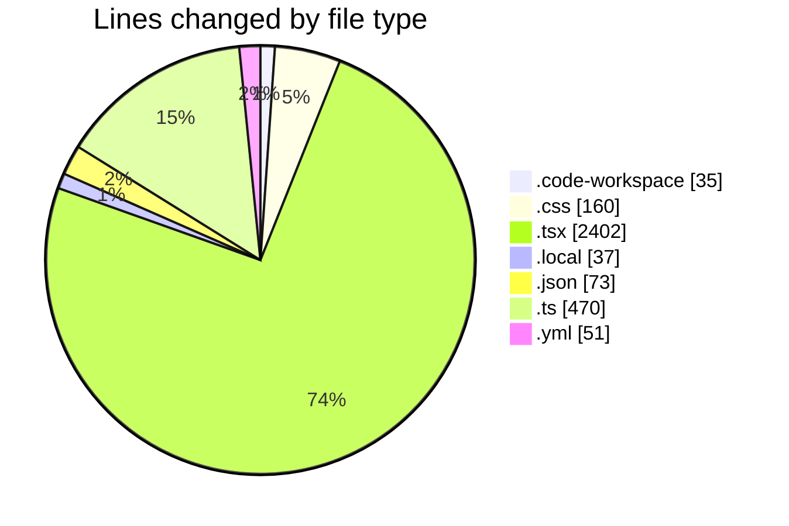
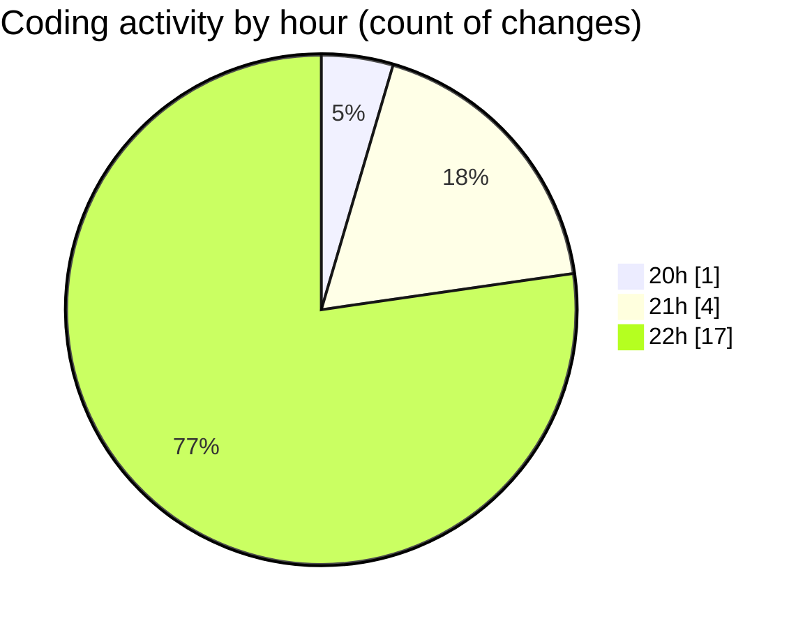

# EventScop (Workspace) - Activity Summary 

## Overall Statistics

| Stat                   | Value                                                             |
| ---------------------- | ----------------------------------------------------------------- |
| **Lines Added** (➕)   | 3226                                          |
| **Lines Removed** (➖) | 2                                        |
| **Net Change** (↕)    | 3224                |
| **Active Time** (⌚)   | 19 minutes |

## Modified Files
- **EventScop.code-workspace** (+35, -0)
- **editor.css** (+160, -0)
- **html-editor.tsx** (+671, -0)
- **.env.local** (+35, -2)
- **tasks.json** (+73, -0)
- **client.ts** (+99, -0)
- **actions.ts** (+29, -0)
- **actions.ts** (+40, -0)
- **client.ts** (+83, -0)
- **stored-files.ts** (+26, -0)
- **page.tsx** (+172, -0)
- **page.tsx** (+211, -0)
- **page.tsx** (+952, -0)
- **page.tsx** (+145, -0)
- **page.tsx** (+251, -0)
- **auth.ts** (+193, -0)
- **docker-compose.yml** (+51, -0)

## Visualizations

### By File Type (Lines Changed)

### By Hour (Estimated Activity Count)

> **Last Updated:** 11/19/2025, 10:54:37 PM