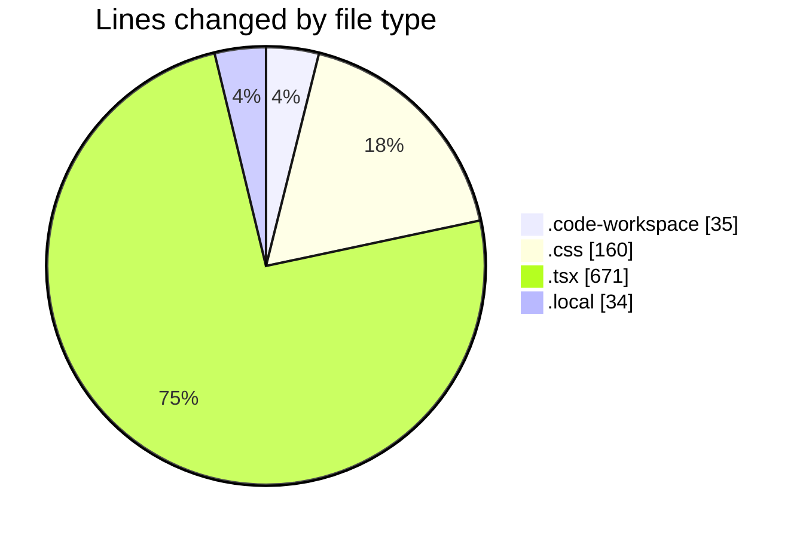
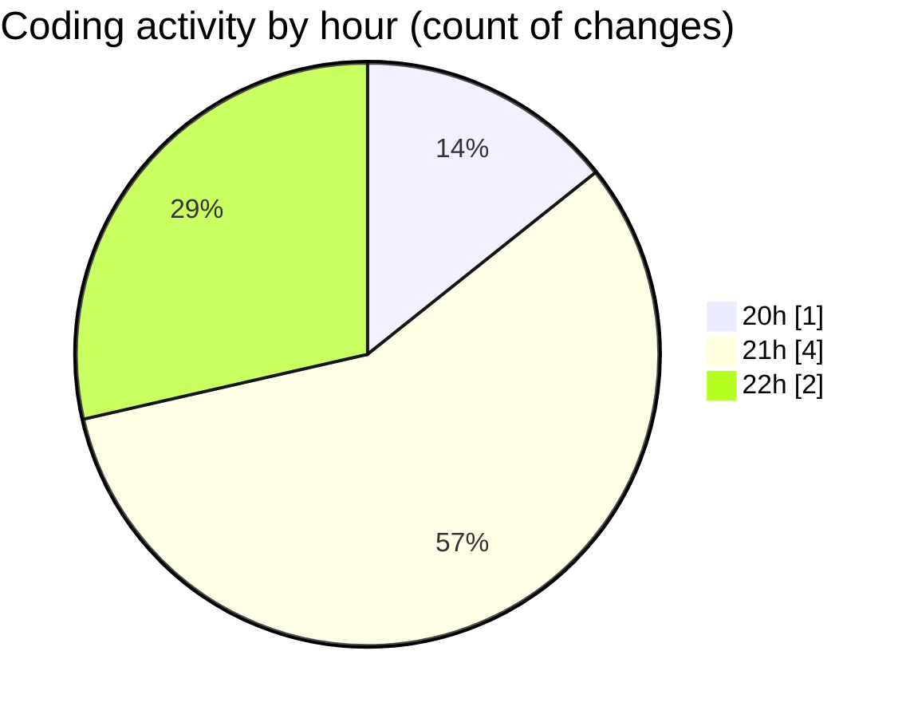

# EventScop (Workspace) - Activity Summary 

## Overall Statistics

| Stat                   | Value                                                             |
| ---------------------- | ----------------------------------------------------------------- |
| **Lines Added** (➕)   | 900                                          |
| **Lines Removed** (➖) | 0                                        |
| **Net Change** (↕)    | 900                |
| **Active Time** (⌚)   | 4 minutes |

## Modified Files
- **EventScop.code-workspace** (+35, -0)
- **editor.css** (+160, -0)
- **html-editor.tsx** (+671, -0)
- **.env.local** (+34, -0)

## Visualizations

### By File Type (Lines Changed)

### By Hour (Estimated Activity Count)

> **Last Updated:** 11/19/2025, 10:29:37 PM