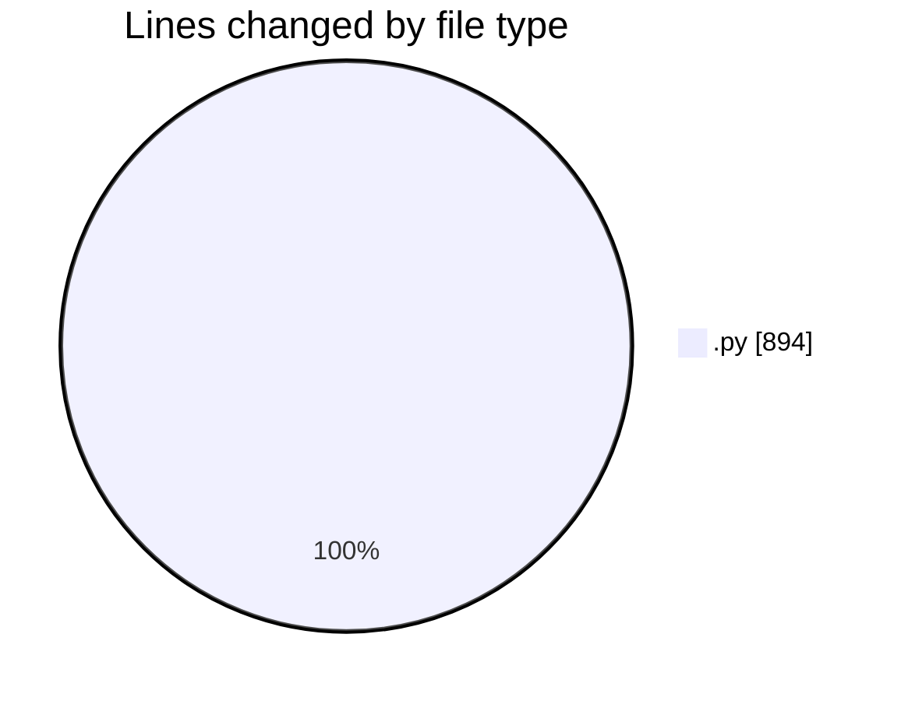
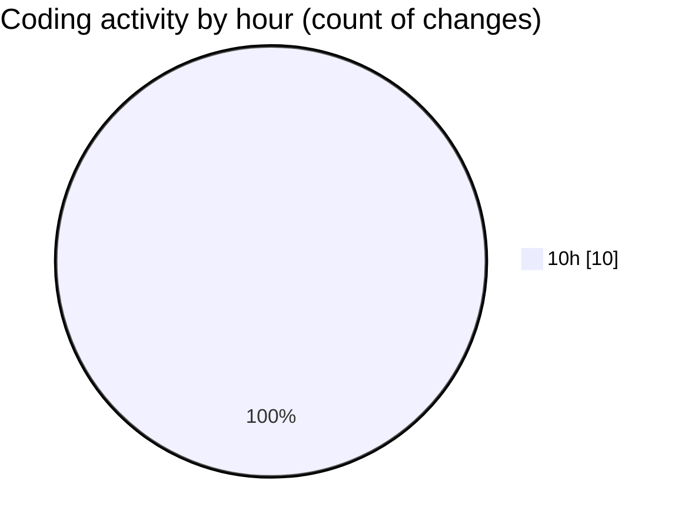

# eventscop-api-guide (Workspace) - Activity Summary 

## Overall Statistics

| Stat                   | Value                                                             |
| ---------------------- | ----------------------------------------------------------------- |
| **Lines Added** (➕)   | 888                                          |
| **Lines Removed** (➖) | 6                                        |
| **Net Change** (↕)    | 882                |
| **Active Time** (⌚)   | 15 minutes |

## Modified Files
- **routes.py** (+393, -0)
- **service.py** (+259, -0)
- **__init__.py** (+26, -0)
- **test_auth_setup.py** (+210, -6)

## Visualizations

### By File Type (Lines Changed)

### By Hour (Estimated Activity Count)

> **Last Updated:** 11/20/2025, 10:38:20 AM