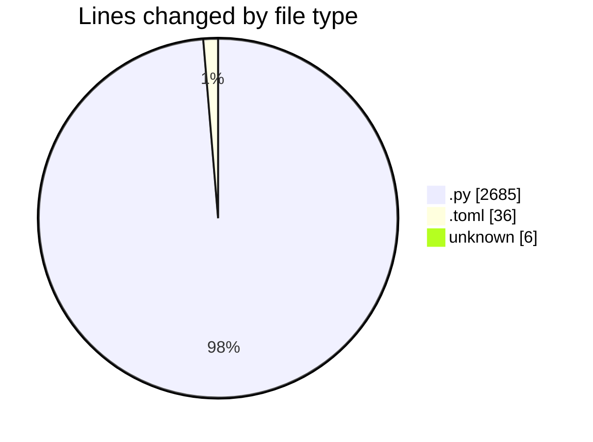
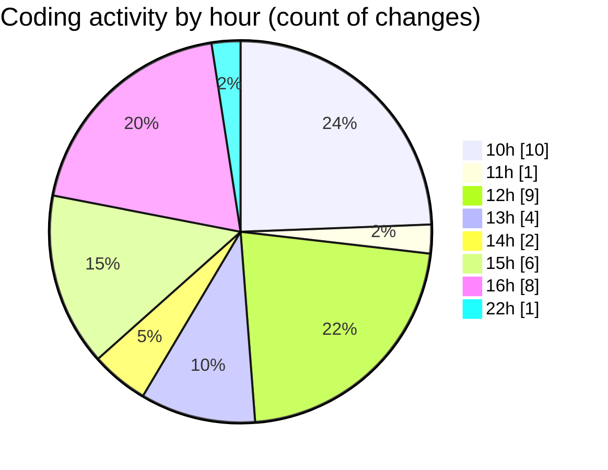

# eventscop-api-guide (Workspace) - Activity Summary 

## Overall Statistics

| Stat                   | Value                                                             |
| ---------------------- | ----------------------------------------------------------------- |
| **Lines Added** (➕)   | 2702                                          |
| **Lines Removed** (➖) | 25                                        |
| **Net Change** (↕)    | 2677                |
| **Active Time** (⌚)   | 42 minutes |

## Modified Files
- **routes.py** (+393, -0)
- **service.py** (+259, -0)
- **__init__.py** (+26, -0)
- **test_auth_setup.py** (+210, -6)
- **activity_search_engine.py** (+91, -1)
- **ReferencedSearch.py** (+134, -0)
- **pyproject.toml** (+32, -4)
- **b057b146cff2_update_presearch.py** (+38, -0)
- **COMMIT_EDITMSG** (+2, -0)
- **d879f42f9b12_add_trad_cookie_banner.py** (+539, -0)
- **.env** (+2, -2)
- **HMAC.py** (+58, -12)
- **search_engine.py** (+918, -0)

## Visualizations

### By File Type (Lines Changed)

### By Hour (Estimated Activity Count)

> **Last Updated:** 11/20/2025, 10:29:14 PM