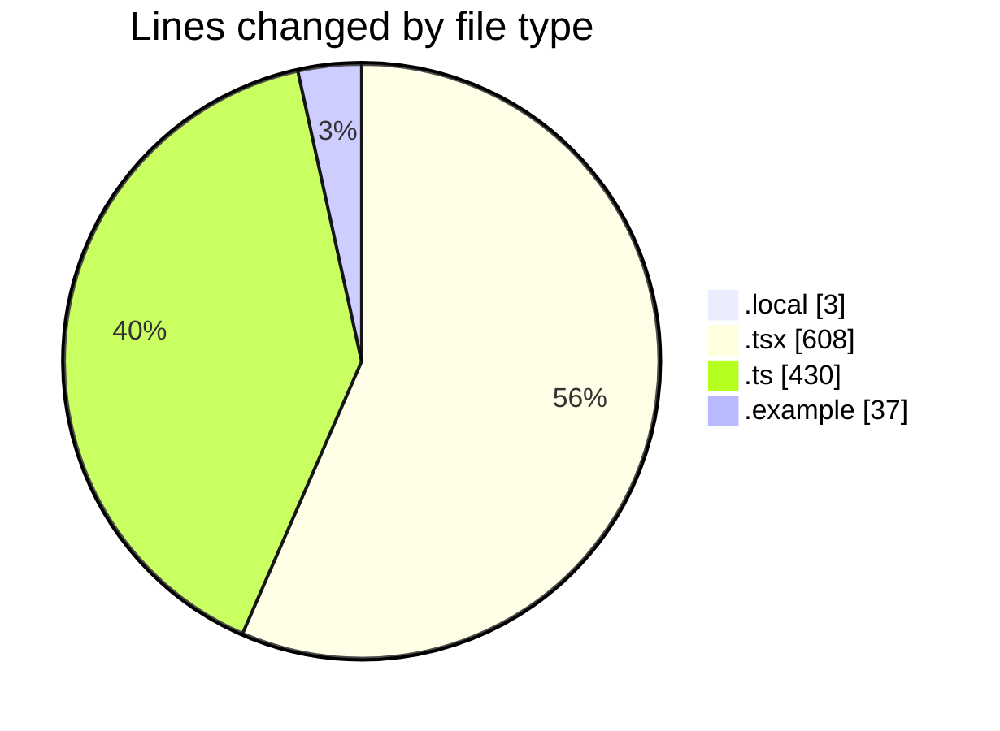
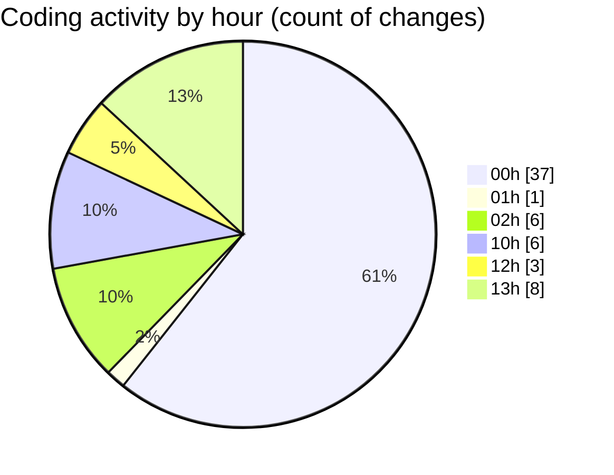

# eventscop-frontend-guide (Workspace) - Activity Summary 

## Overall Statistics

| Stat                   | Value                                                             |
| ---------------------- | ----------------------------------------------------------------- |
| **Lines Added** (➕)   | 1011                                          |
| **Lines Removed** (➖) | 67                                        |
| **Net Change** (↕)    | 944                |
| **Active Time** (⌚)   | 74 minutes |

## Modified Files
- **.env.local** (+3, -0)
- **layout.tsx** (+180, -7)
- **metadata.ts** (+84, -1)
- **google.ts** (+48, -3)
- **actions.ts** (+40, -0)
- **LazyAnalytics.tsx** (+61, -1)
- **useAnalytics.ts** (+62, -13)
- **DelayedAnalytics.tsx** (+60, -18)
- **DelayedAnalytics.tsx** (+42, -0)
- **stored-files.ts** (+35, -12)
- **actions.ts** (+29, -0)
- **.env.example** (+36, -1)
- **route.ts** (+7, -7)
- **editorial-variables.ts** (+3, -3)
- **presearch.ts** (+82, -1)
- **PresearchSectionWrapper.tsx** (+123, -0)
- **ClientPresearchSection.tsx** (+81, -0)
- **page.tsx** (+35, -0)

## Visualizations

### By File Type (Lines Changed)

### By Hour (Estimated Activity Count)

> **Last Updated:** 11/20/2025, 1:37:21 PM