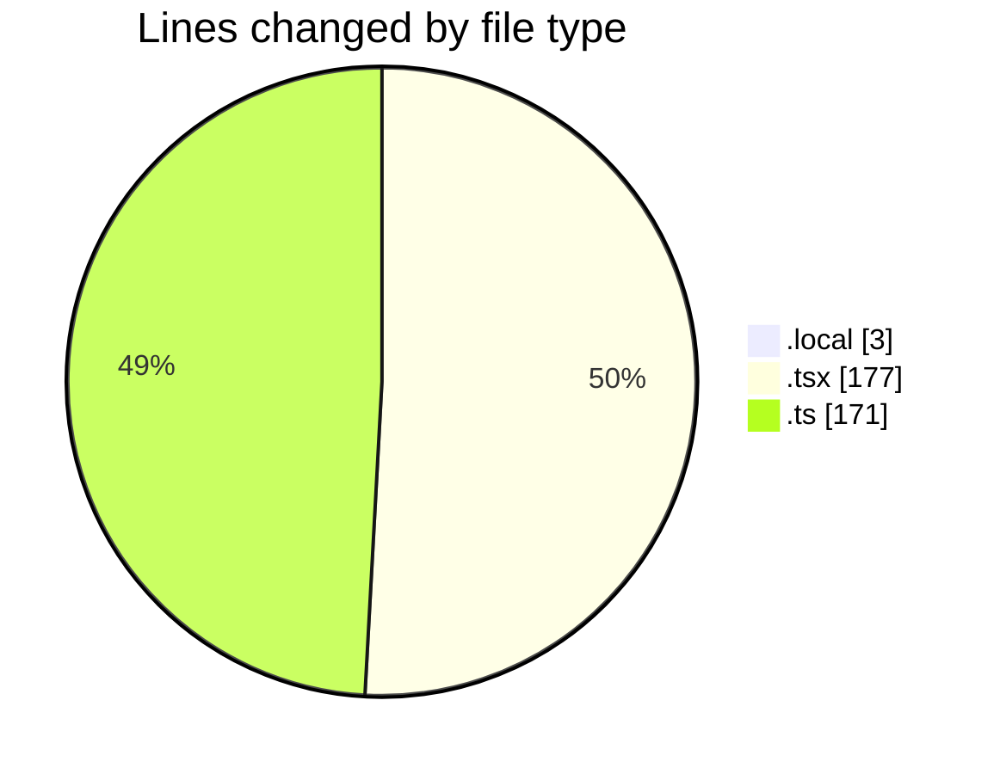

# eventscop-frontend-guide (Workspace) - Activity Summary 

## Overall Statistics

| Stat                   | Value                                                             |
| ---------------------- | ----------------------------------------------------------------- |
| **Lines Added** (➕)   | 351                                          |
| **Lines Removed** (➖) | 0                                        |
| **Net Change** (↕)    | 351                |
| **Active Time** (⌚)   | 18 minutes |

## Modified Files
- **.env.local** (+3, -0)
- **layout.tsx** (+176, -0)
- **metadata.ts** (+83, -0)
- **google.ts** (+48, -0)
- **actions.ts** (+40, -0)
- **LazyAnalytics.tsx** (+1, -0)

## Visualizations

### By File Type (Lines Changed)

### By Hour (Estimated Activity Count)

> **Last Updated:** 11/20/2025, 12:32:18 AM