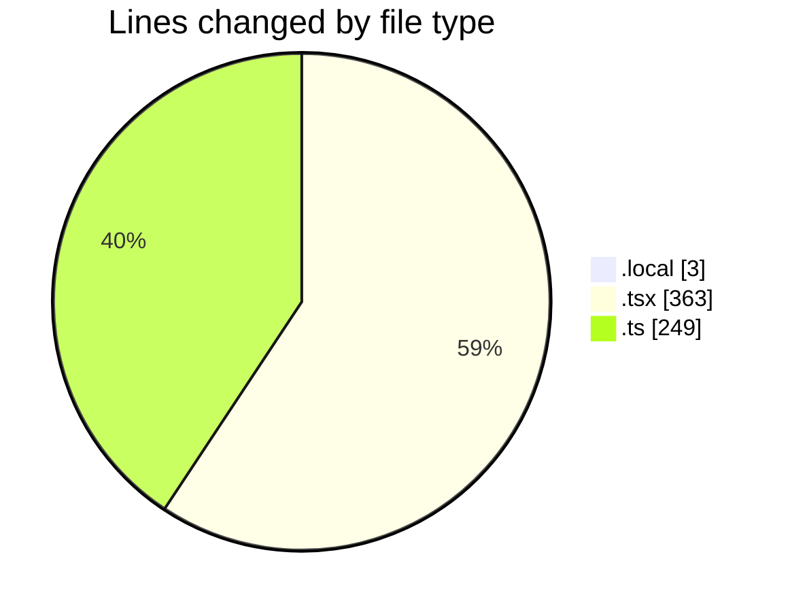

# eventscop-frontend-guide (Workspace) - Activity Summary 

## Overall Statistics

| Stat                   | Value                                                             |
| ---------------------- | ----------------------------------------------------------------- |
| **Lines Added** (➕)   | 576                                          |
| **Lines Removed** (➖) | 39                                        |
| **Net Change** (↕)    | 537                |
| **Active Time** (⌚)   | 43 minutes |

## Modified Files
- **.env.local** (+3, -0)
- **layout.tsx** (+177, -4)
- **metadata.ts** (+83, -0)
- **google.ts** (+48, -3)
- **actions.ts** (+40, -0)
- **LazyAnalytics.tsx** (+61, -1)
- **useAnalytics.ts** (+62, -13)
- **DelayedAnalytics.tsx** (+60, -18)
- **DelayedAnalytics.tsx** (+42, -0)

## Visualizations

### By File Type (Lines Changed)

### By Hour (Estimated Activity Count)

> **Last Updated:** 11/20/2025, 12:52:18 AM