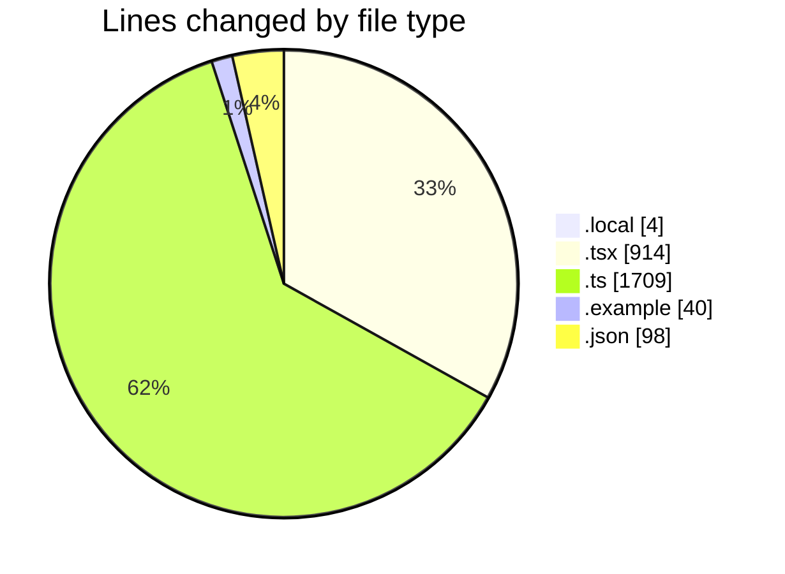
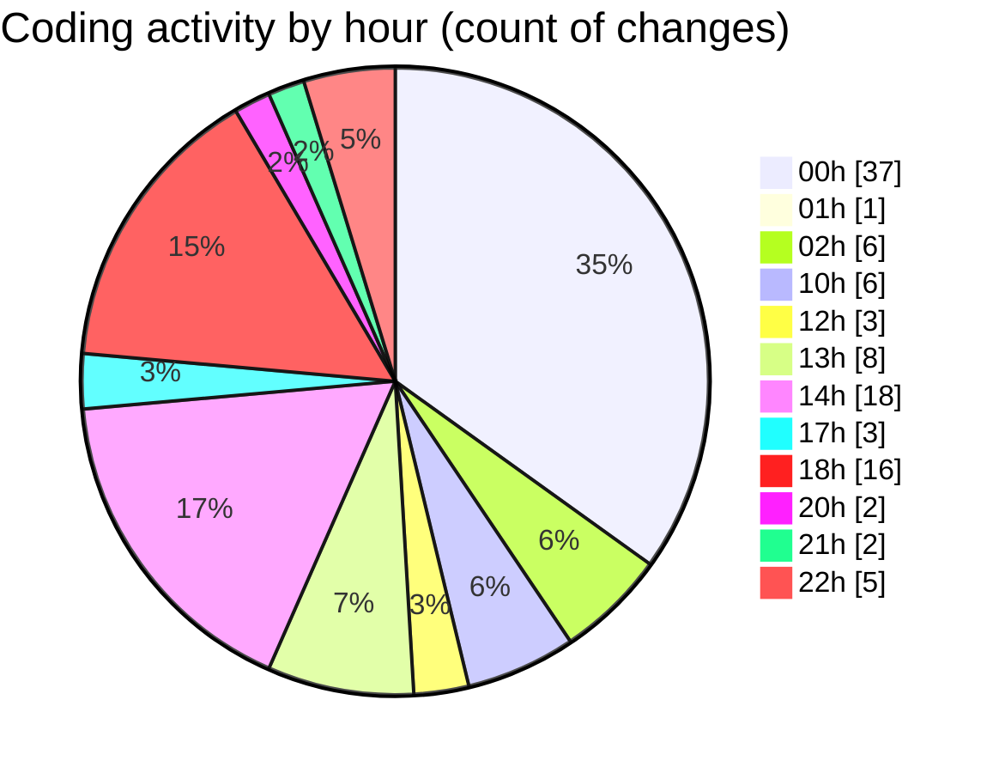

# eventscop-frontend-guide (Workspace) - Activity Summary 

## Overall Statistics

| Stat                   | Value                                                             |
| ---------------------- | ----------------------------------------------------------------- |
| **Lines Added** (➕)   | 2589                                          |
| **Lines Removed** (➖) | 176                                        |
| **Net Change** (↕)    | 2413                |
| **Active Time** (⌚)   | 111 minutes |

## Modified Files
- **.env.local** (+4, -0)
- **layout.tsx** (+183, -10)
- **metadata.ts** (+85, -2)
- **google.ts** (+48, -31)
- **actions.ts** (+40, -0)
- **LazyAnalytics.tsx** (+61, -1)
- **useAnalytics.ts** (+62, -13)
- **DelayedAnalytics.tsx** (+60, -18)
- **DelayedAnalytics.tsx** (+48, -0)
- **stored-files.ts** (+38, -15)
- **actions.ts** (+29, -0)
- **.env.example** (+38, -2)
- **route.ts** (+14, -14)
- **editorial-variables.ts** (+6, -6)
- **presearch.ts** (+82, -1)
- **PresearchSectionWrapper.tsx** (+130, -7)
- **ClientPresearchSection.tsx** (+83, -2)
- **page.tsx** (+35, -0)
- **fr.json** (+49, -49)
- **api-auth.ts** (+57, -2)
- **index.ts** (+53, -1)
- **api-fetch.ts** (+117, -0)
- **api-fetch.ts** (+49, -0)
- **suppliers.ts** (+439, -0)
- **page.tsx** (+67, -0)
- **page.tsx** (+56, -0)
- **customer-reviews.ts** (+92, -0)
- **departments.ts** (+150, -0)
- **reviews.ts** (+154, -0)
- **cities.ts** (+52, -0)
- **gcp-auth-wif.ts** (+56, -1)
- **PresearchBanner.tsx** (+152, -1)

## Visualizations

### By File Type (Lines Changed)

### By Hour (Estimated Activity Count)

> **Last Updated:** 11/20/2025, 10:12:22 PM