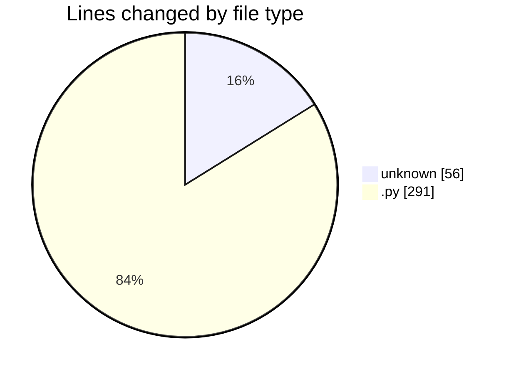
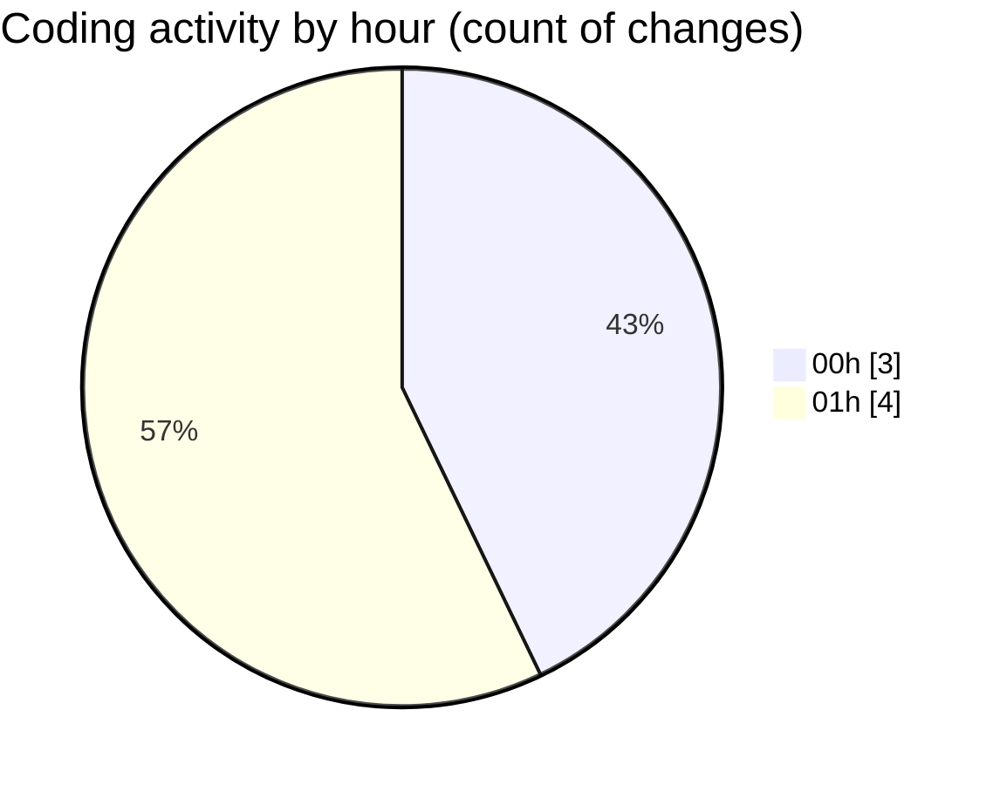

# eventscop-api-guide - Activity Summary 

## Overall Statistics

| Stat                   | Value                                                             |
| ---------------------- | ----------------------------------------------------------------- |
| **Lines Added** (➕)   | 346                                          |
| **Lines Removed** (➖) | 1                                        |
| **Net Change** (↕)    | 345                |
| **Active Time** (⌚)   | 5 minutes |

## Modified Files
- **.env** (+55, -1)
- **schemas.py** (+55, -0)
- **routes.py** (+236, -0)

## Visualizations

### By File Type (Lines Changed)

### By Hour (Estimated Activity Count)

> **Last Updated:** 11/21/2025, 1:04:48 AM