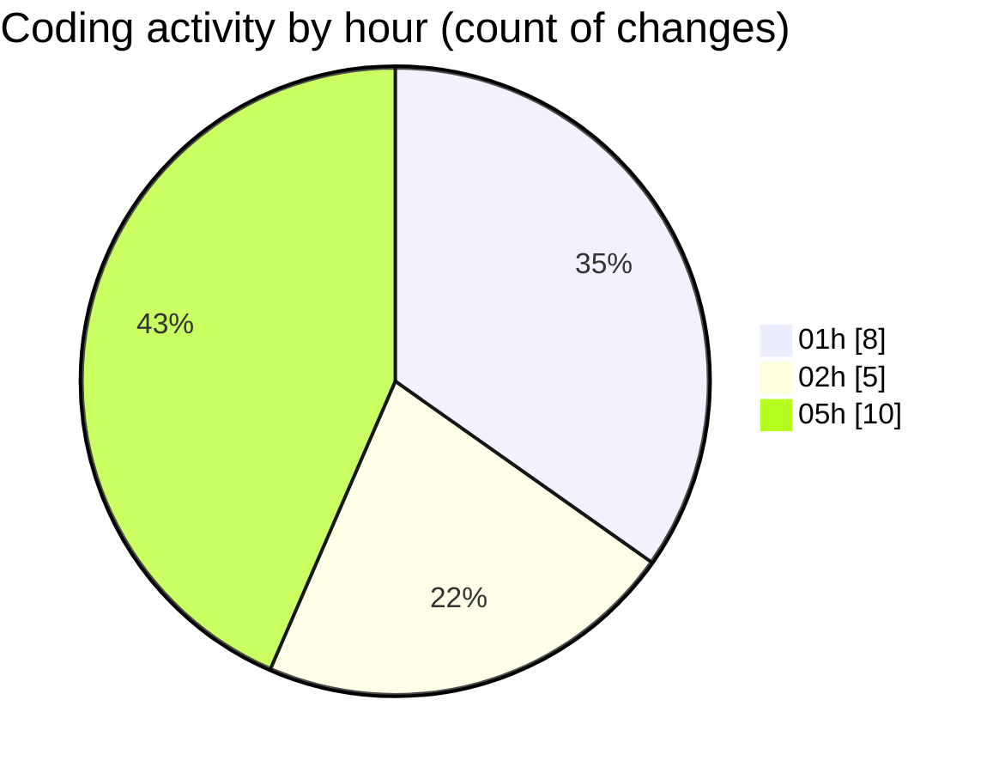

# eventscop-api-guide (Workspace) - Activity Summary 

## Overall Statistics

| Stat                   | Value                                                             |
| ---------------------- | ----------------------------------------------------------------- |
| **Lines Added** (➕)   | 2309                                          |
| **Lines Removed** (➖) | 132                                        |
| **Net Change** (↕)    | 2177                |
| **Active Time** (⌚)   | 26 minutes |

## Modified Files
- **20251120_add_trigram_indexes_action_areas.py** (+59, -0)
- **activity_search_engine.py** (+31, -112)
- **__init__.py** (+155, -0)
- **20251120_populate_supplier_action_areas.py** (+4, -0)
- **EntityVisitDay.py** (+20, -0)
- **schemas.py** (+43, -1)
- **schemas_base.py** (+122, -1)
- **routes.py** (+842, -11)
- **routes.py** (+972, -0)
- **main.py** (+1, -7)
- **SupplierActivity.py** (+60, -0)

## Visualizations

### By File Type (Lines Changed)

### By Hour (Estimated Activity Count)

> **Last Updated:** 11/21/2025, 5:29:17 AM