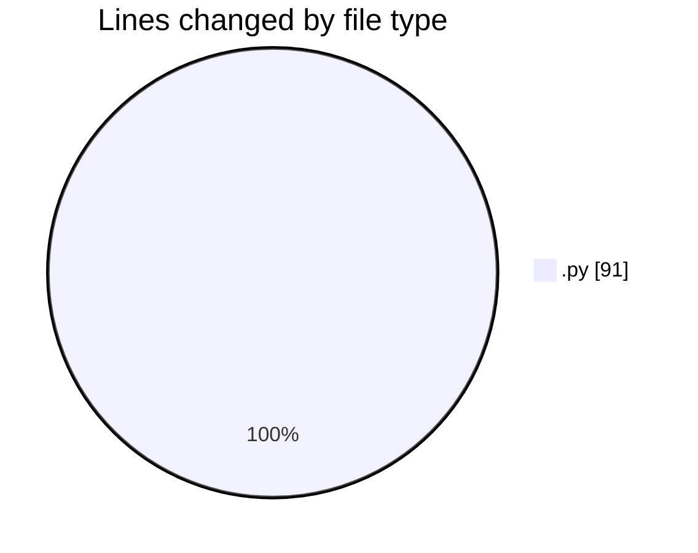
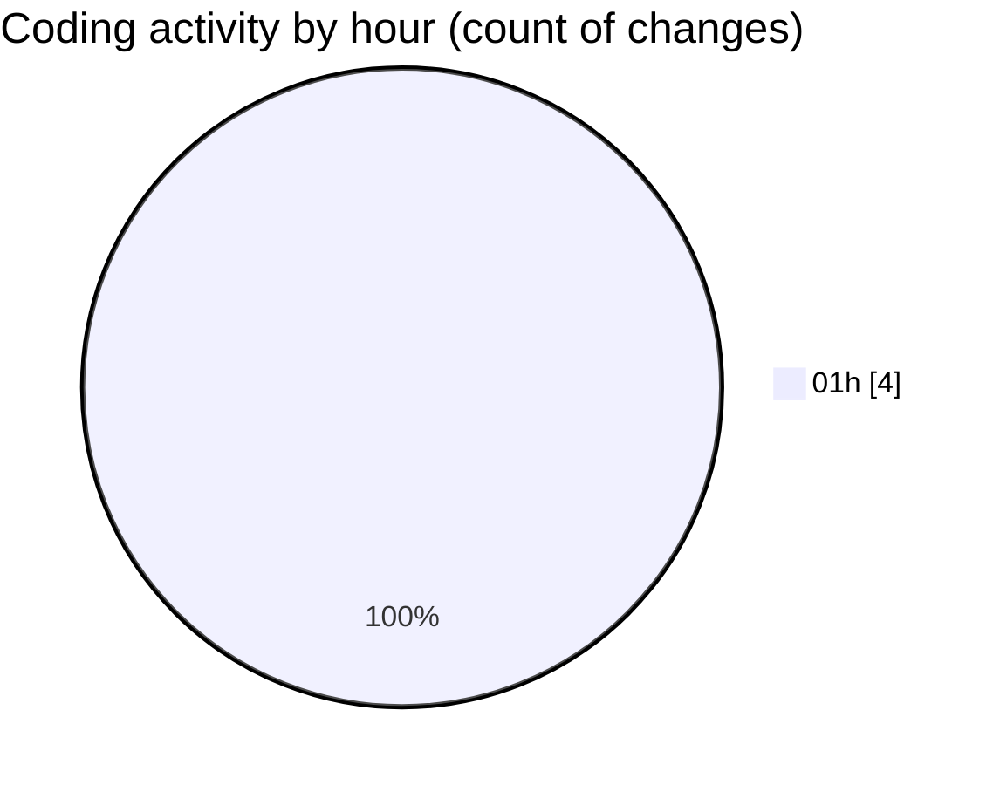

# eventscop-api-guide (Workspace) - Activity Summary 

## Overall Statistics

| Stat                   | Value                                                             |
| ---------------------- | ----------------------------------------------------------------- |
| **Lines Added** (➕)   | 89                                          |
| **Lines Removed** (➖) | 2                                        |
| **Net Change** (↕)    | 87                |
| **Active Time** (⌚)   | 8 minutes |

## Modified Files
- **20251120_add_trigram_indexes_action_areas.py** (+59, -0)
- **activity_search_engine.py** (+30, -2)

## Visualizations

### By File Type (Lines Changed)

### By Hour (Estimated Activity Count)

> **Last Updated:** 11/21/2025, 1:19:14 AM