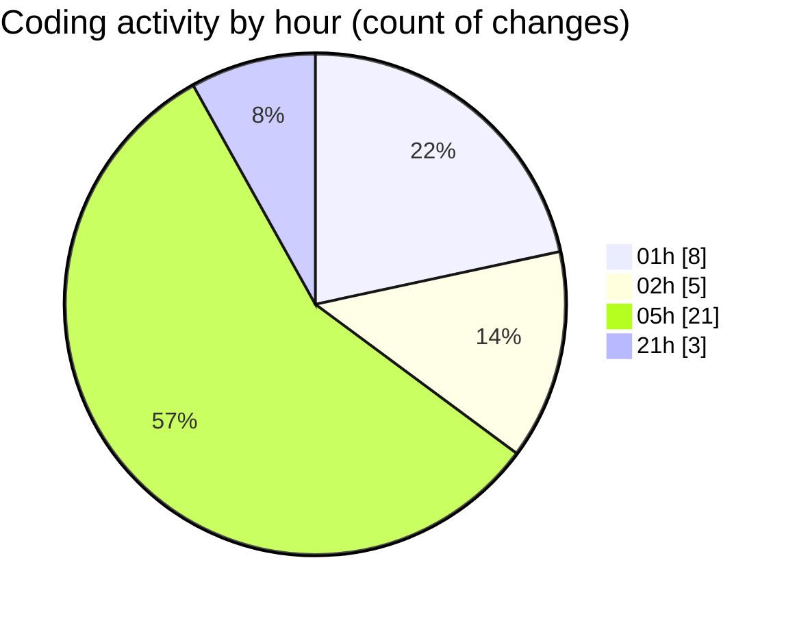

# eventscop-api-guide (Workspace) - Activity Summary 

## Overall Statistics

| Stat                   | Value                                                             |
| ---------------------- | ----------------------------------------------------------------- |
| **Lines Added** (➕)   | 2601                                          |
| **Lines Removed** (➖) | 137                                        |
| **Net Change** (↕)    | 2464                |
| **Active Time** (⌚)   | 38 minutes |

## Modified Files
- **20251120_add_trigram_indexes_action_areas.py** (+59, -0)
- **activity_search_engine.py** (+141, -112)
- **__init__.py** (+155, -0)
- **20251120_populate_supplier_action_areas.py** (+4, -0)
- **EntityVisitDay.py** (+20, -0)
- **schemas.py** (+43, -1)
- **schemas_base.py** (+123, -1)
- **routes.py** (+853, -11)
- **routes.py** (+972, -0)
- **main.py** (+90, -8)
- **SupplierActivity.py** (+83, -0)
- **search_engine.py** (+4, -4)
- **.env** (+54, -0)

## Visualizations

### By File Type (Lines Changed)

### By Hour (Estimated Activity Count)

> **Last Updated:** 11/21/2025, 9:13:37 PM