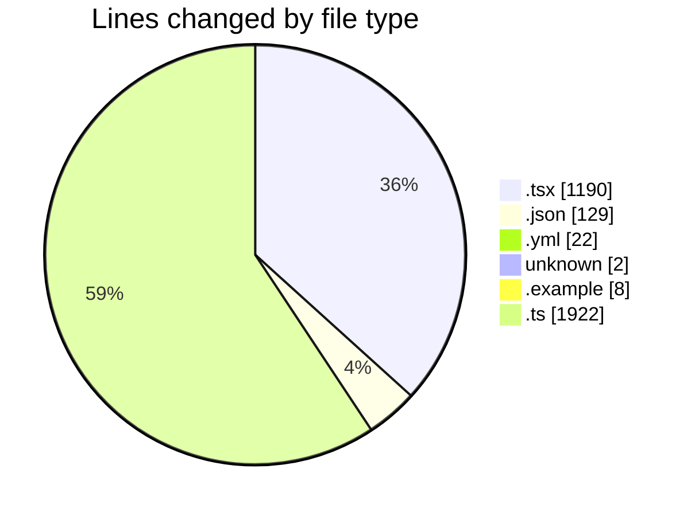
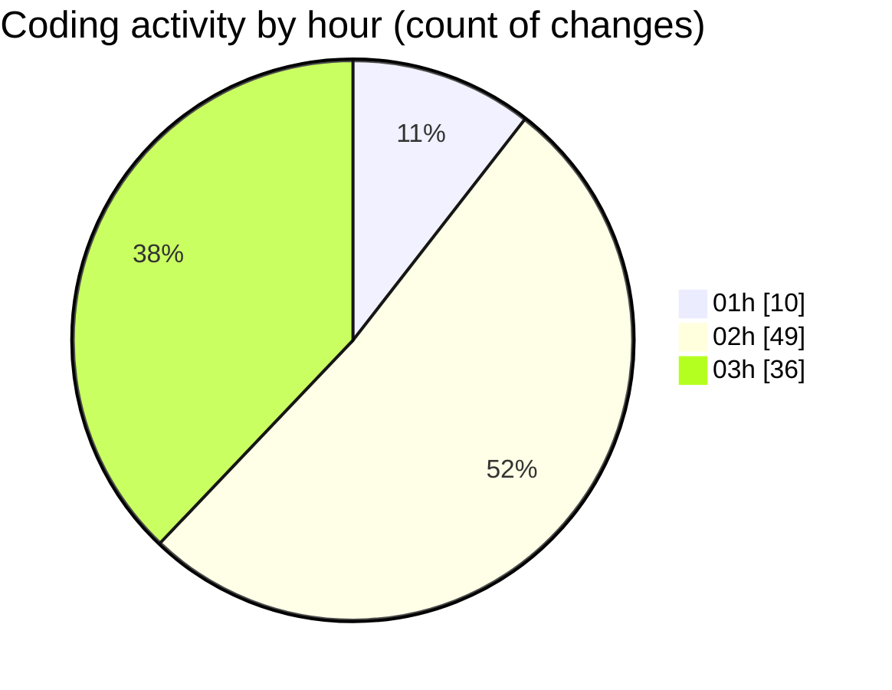

# eventscop-frontend-guide (Workspace) - Activity Summary 

## Overall Statistics

| Stat                   | Value                                                             |
| ---------------------- | ----------------------------------------------------------------- |
| **Lines Added** (➕)   | 3243                                          |
| **Lines Removed** (➖) | 30                                        |
| **Net Change** (↕)    | 3213                |
| **Active Time** (⌚)   | 136 minutes |

## Modified Files
- **WelcomeSelectSteps.tsx** (+136, -2)
- **RseCategoryItem.tsx** (+42, -0)
- **biome.json** (+126, -3)
- **SuggestionsSkeleton.tsx** (+29, -0)
- **RseSkeleton.tsx** (+30, -0)
- **ReviewsSkeleton.tsx** (+45, -0)
- **SidebarSkeleton.tsx** (+24, -0)
- **PlaceCardDescription.tsx** (+48, -0)
- **lefthook.yml** (+22, -0)
- **COMMIT_EDITMSG** (+2, -0)
- **PresearchBanner.tsx** (+2, -2)
- **.env.example** (+4, -4)
- **SearchPageForm.tsx** (+350, -0)
- **search.ts** (+151, -0)
- **supplier-activity.ts** (+362, -0)
- **search-tags.ts** (+356, -2)
- **SearchFormAndFilters.tsx** (+48, -0)
- **filters.ts** (+175, -0)
- **ActivitySearchClient.tsx** (+74, -2)
- **search-components.ts** (+56, -1)
- **ActivityGrid.tsx** (+75, -0)
- **page.tsx** (+202, -2)
- **criteria-helpers.ts** (+65, -0)
- **server-helpers.ts** (+50, -0)
- **ActivitySearchContainer.tsx** (+76, -1)
- **supplier-activities.ts** (+340, -5)
- **search-actions.ts** (+117, -0)
- **useActivitySearch.ts** (+61, -5)
- **search-hooks.ts** (+109, -1)
- **constants.ts** (+66, -0)

## Visualizations

### By File Type (Lines Changed)

### By Hour (Estimated Activity Count)

> **Last Updated:** 11/21/2025, 3:42:23 AM