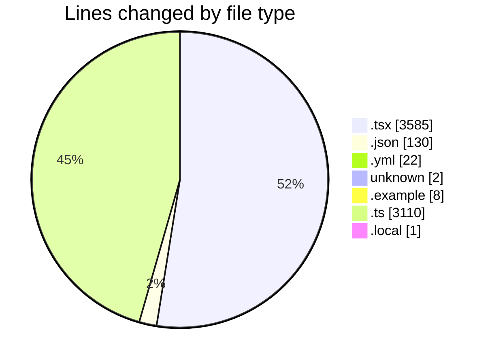
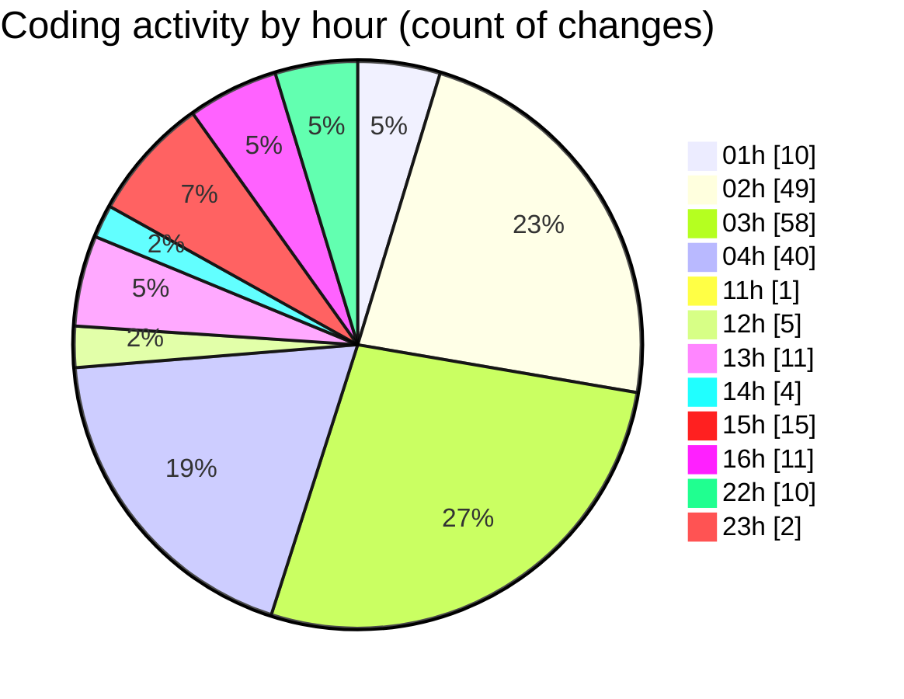

# eventscop-frontend-guide (Workspace) - Activity Summary 

## Overall Statistics

| Stat                   | Value                                                             |
| ---------------------- | ----------------------------------------------------------------- |
| **Lines Added** (➕)   | 6413                                          |
| **Lines Removed** (➖) | 445                                        |
| **Net Change** (↕)    | 5968                |
| **Active Time** (⌚)   | 298 minutes |

## Modified Files
- **WelcomeSelectSteps.tsx** (+136, -2)
- **RseCategoryItem.tsx** (+42, -0)
- **biome.json** (+127, -3)
- **SuggestionsSkeleton.tsx** (+29, -0)
- **RseSkeleton.tsx** (+30, -0)
- **ReviewsSkeleton.tsx** (+45, -0)
- **SidebarSkeleton.tsx** (+24, -0)
- **PlaceCardDescription.tsx** (+48, -0)
- **lefthook.yml** (+22, -0)
- **COMMIT_EDITMSG** (+2, -0)
- **PresearchBanner.tsx** (+2, -2)
- **.env.example** (+4, -4)
- **SearchPageForm.tsx** (+350, -0)
- **search.ts** (+151, -0)
- **supplier-activity.ts** (+362, -0)
- **search-tags.ts** (+356, -2)
- **SearchFormAndFilters.tsx** (+48, -0)
- **filters.ts** (+175, -0)
- **ActivitySearchClient.tsx** (+77, -6)
- **search-components.ts** (+56, -8)
- **ActivityGrid.tsx** (+76, -2)
- **page.tsx** (+241, -43)
- **criteria-helpers.ts** (+65, -0)
- **server-helpers.ts** (+50, -1)
- **ActivitySearchContainer.tsx** (+87, -20)
- **supplier-activities.ts** (+340, -5)
- **search-actions.ts** (+117, -1)
- **useActivitySearch.ts** (+62, -5)
- **search-hooks.ts** (+110, -1)
- **constants.ts** (+66, -0)
- **common-utils.ts** (+170, -1)
- **page.tsx** (+293, -1)
- **page.tsx** (+231, -13)
- **page.tsx** (+269, -24)
- **page.tsx** (+174, -1)
- **page.tsx** (+307, -5)
- **useSearch.ts** (+390, -129)
- **SeoPageLayout.tsx** (+45, -3)
- **seo.ts** (+233, -1)
- **rse-heading.ts** (+22, -1)
- **DateAndTimeRangePicker.tsx** (+409, -146)
- **.env.local** (+1, -0)
- **calendar.tsx** (+178, -0)
- **date-time.ts** (+230, -0)
- **ActivityQuoteForm.tsx** (+161, -15)

## Visualizations

### By File Type (Lines Changed)

### By Hour (Estimated Activity Count)

> **Last Updated:** 11/21/2025, 11:07:26 PM