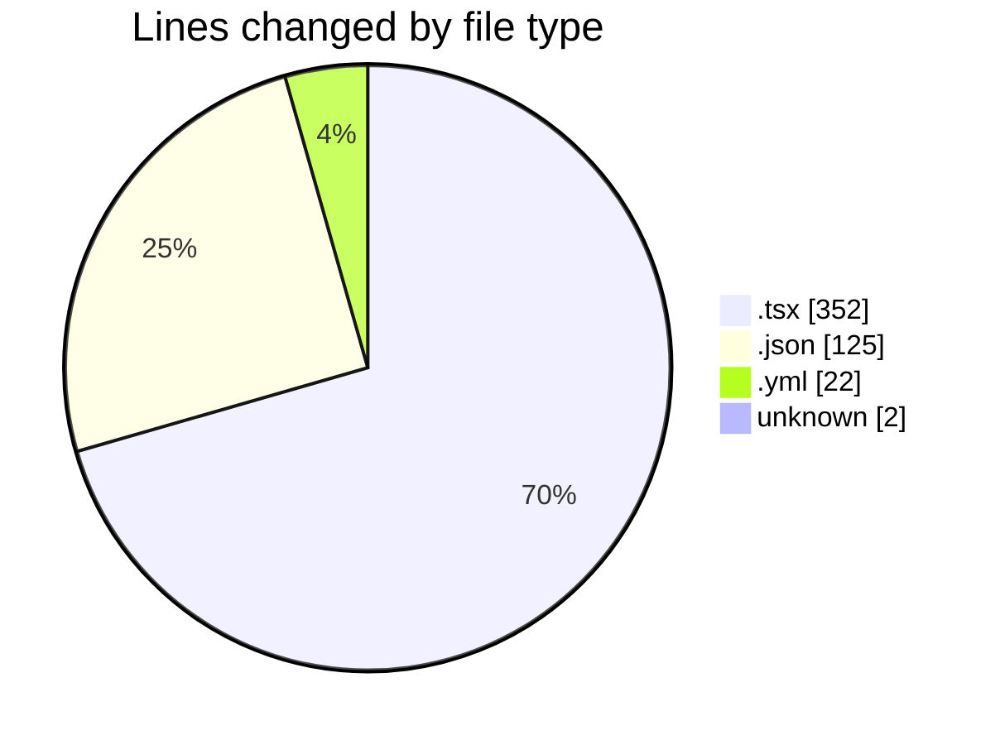
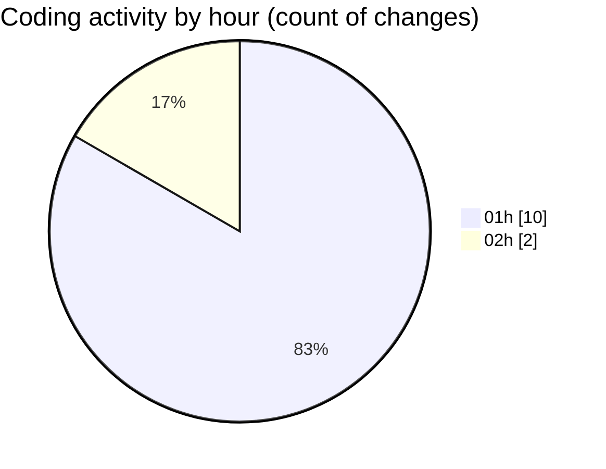

# eventscop-frontend-guide (Workspace) - Activity Summary 

## Overall Statistics

| Stat                   | Value                                                             |
| ---------------------- | ----------------------------------------------------------------- |
| **Lines Added** (➕)   | 500                                          |
| **Lines Removed** (➖) | 1                                        |
| **Net Change** (↕)    | 499                |
| **Active Time** (⌚)   | 17 minutes |

## Modified Files
- **WelcomeSelectSteps.tsx** (+134, -0)
- **RseCategoryItem.tsx** (+42, -0)
- **biome.json** (+124, -1)
- **SuggestionsSkeleton.tsx** (+29, -0)
- **RseSkeleton.tsx** (+30, -0)
- **ReviewsSkeleton.tsx** (+45, -0)
- **SidebarSkeleton.tsx** (+24, -0)
- **PlaceCardDescription.tsx** (+48, -0)
- **lefthook.yml** (+22, -0)
- **COMMIT_EDITMSG** (+2, -0)

## Visualizations

### By File Type (Lines Changed)

### By Hour (Estimated Activity Count)

> **Last Updated:** 11/21/2025, 2:07:22 AM