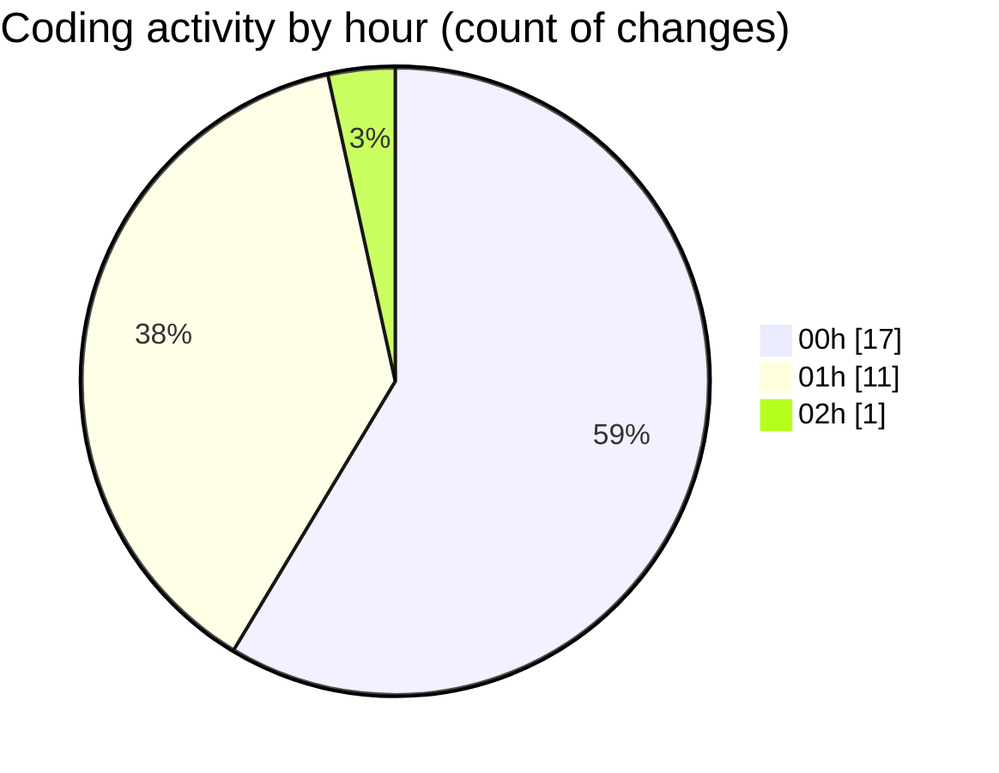

# eventscop-api-guide (Workspace) - Activity Summary 

## Overall Statistics

| Stat                   | Value                                                             |
| ---------------------- | ----------------------------------------------------------------- |
| **Lines Added** (➕)   | 9887                                          |
| **Lines Removed** (➖) | 8119                                        |
| **Net Change** (↕)    | 1768                |
| **Active Time** (⌚)   | 27 minutes |

## Modified Files
- **routes.py** (+638, -26)
- **20251121abcd123_fix_missing_extensions_and_indexes.py** (+0, -1)
- **env.py** (+85, -85)
- **.env** (+1, -0)
- **20251120_populate_supplier_action_areas.py** (+110, -13)
- **postgres_objects.py** (+1, -1)
- **20251120_add_trigram_indexes_action_areas.py** (+59, -3)
- **20251120_create_supplier_action_areas_table.py** (+111, -9)
- **9e55e953cd63_test.py** (+8040, -7981)
- **routes.py** (+842, -0)

## Visualizations

### By File Type (Lines Changed)

### By Hour (Estimated Activity Count)

> **Last Updated:** 11/22/2025, 2:18:37 AM