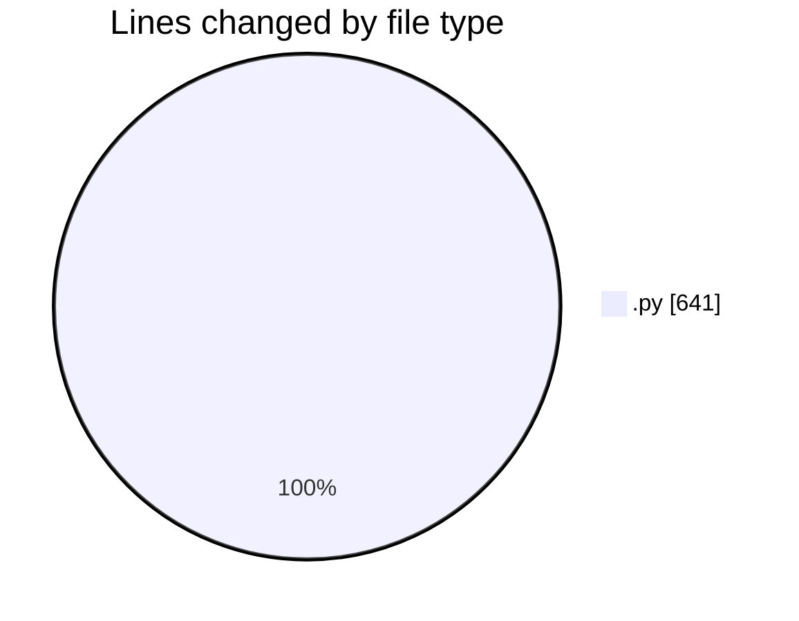
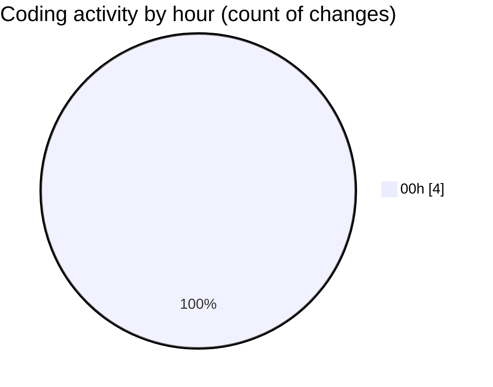

# eventscop-api-guide (Workspace) - Activity Summary 

## Overall Statistics

| Stat                   | Value                                                             |
| ---------------------- | ----------------------------------------------------------------- |
| **Lines Added** (➕)   | 612                                          |
| **Lines Removed** (➖) | 29                                        |
| **Net Change** (↕)    | 583                |
| **Active Time** (⌚)   | 8 minutes |

## Modified Files
- **routes.py** (+612, -13)
- **20251121abcd123_fix_missing_extensions_and_indexes.py** (+0, -1)
- **env.py** (+0, -15)

## Visualizations

### By File Type (Lines Changed)

### By Hour (Estimated Activity Count)

> **Last Updated:** 11/22/2025, 12:33:37 AM