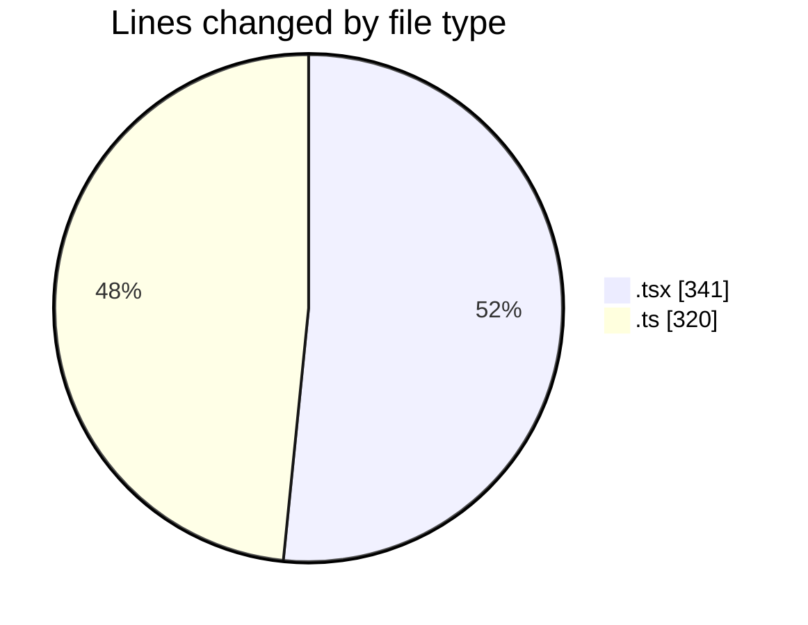
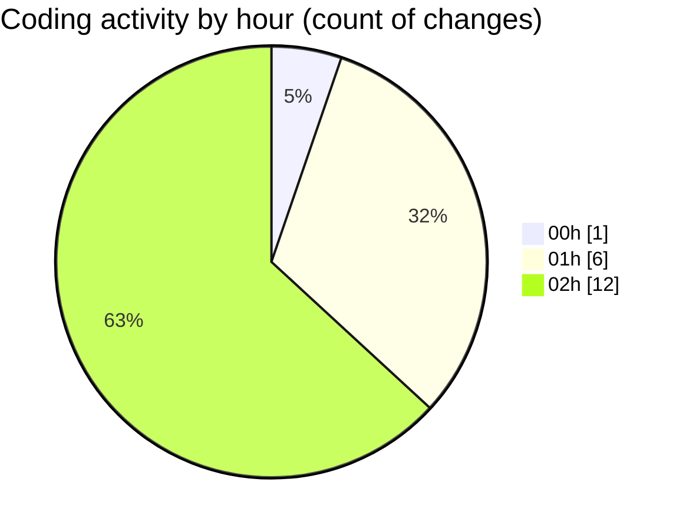

# eventscop-frontend-guide (Workspace) - Activity Summary 

## Overall Statistics

| Stat                   | Value                                                             |
| ---------------------- | ----------------------------------------------------------------- |
| **Lines Added** (➕)   | 649                                          |
| **Lines Removed** (➖) | 12                                        |
| **Net Change** (↕)    | 637                |
| **Active Time** (⌚)   | 18 minutes |

## Modified Files
- **DatesModal.tsx** (+0, -1)
- **ActivityQuoteForm.tsx** (+10, -0)
- **HorizontalCard.tsx** (+27, -1)
- **cart.ts** (+314, -2)
- **page.tsx** (+150, -4)
- **supplier-activity.ts** (+0, -4)
- **ActivityCard.tsx** (+148, -0)

## Visualizations

### By File Type (Lines Changed)

### By Hour (Estimated Activity Count)

> **Last Updated:** 11/22/2025, 2:37:29 AM