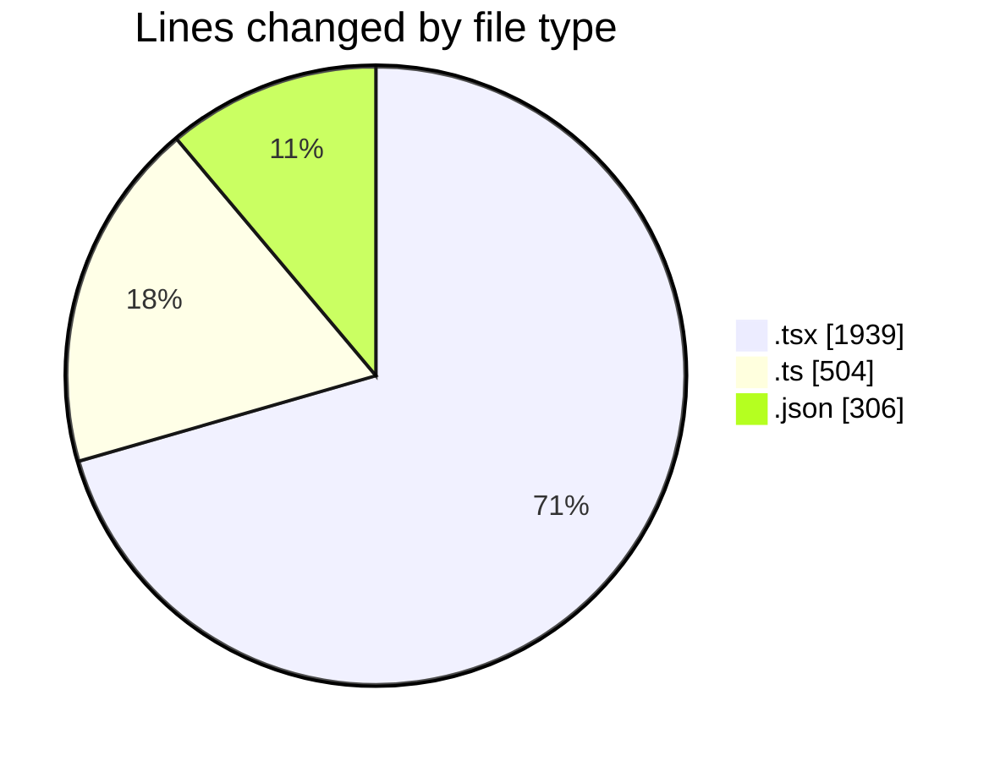
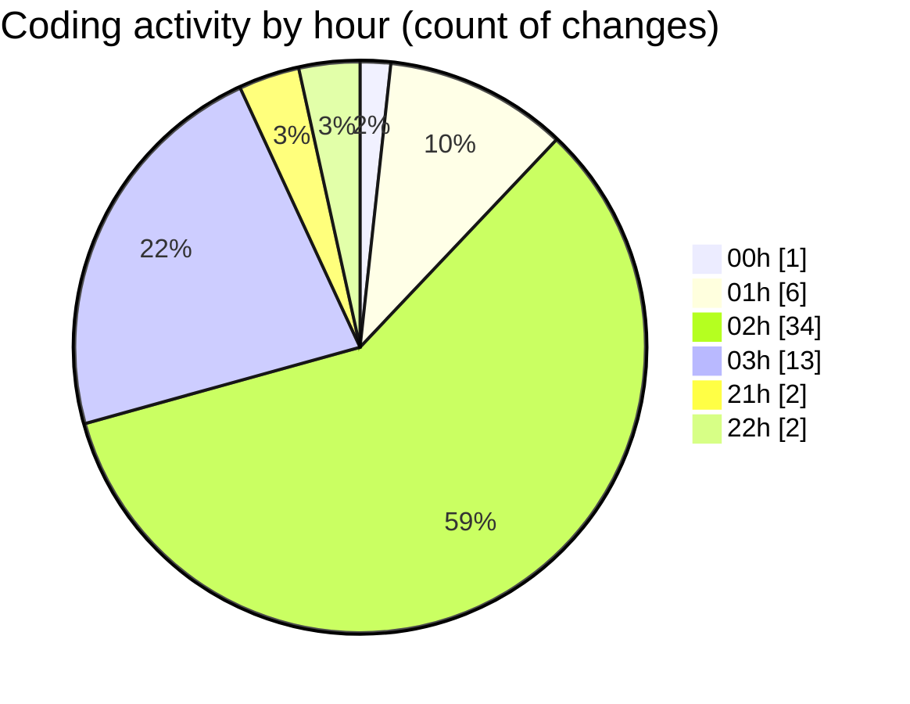

# eventscop-frontend-guide (Workspace) - Activity Summary 

## Overall Statistics

| Stat                   | Value                                                             |
| ---------------------- | ----------------------------------------------------------------- |
| **Lines Added** (➕)   | 2247                                          |
| **Lines Removed** (➖) | 502                                        |
| **Net Change** (↕)    | 1745                |
| **Active Time** (⌚)   | 61 minutes |

## Modified Files
- **DatesModal.tsx** (+0, -9)
- **ActivityQuoteForm.tsx** (+14, -89)
- **HorizontalCard.tsx** (+28, -2)
- **cart.ts** (+316, -3)
- **page.tsx** (+150, -4)
- **supplier-activity.ts** (+4, -4)
- **ActivityCard.tsx** (+294, -146)
- **PlaceCard.tsx** (+133, -0)
- **ActivitySuggestionSection.tsx** (+25, -0)
- **ActivityRating.tsx** (+133, -113)
- **PlaceCardHeader.tsx** (+44, -2)
- **ActivitySearchClient.tsx** (+3, -3)
- **page.tsx** (+425, -0)
- **CityAutocomplete.tsx** (+218, -0)
- **supplier-activities.ts** (+5, -0)
- **server-helpers.ts** (+19, -0)
- **ActivityGrid.tsx** (+2, -0)
- **DateAndTimeRangePicker.tsx** (+0, -83)
- **ActivitySearchContainer.tsx** (+19, -0)
- **date-time.ts** (+0, -44)
- **settings.json** (+306, -0)
- **placeQuoteFormSchema.ts** (+24, -0)
- **plateform.ts** (+85, -0)

## Visualizations

### By File Type (Lines Changed)

### By Hour (Estimated Activity Count)

> **Last Updated:** 11/22/2025, 10:32:30 PM