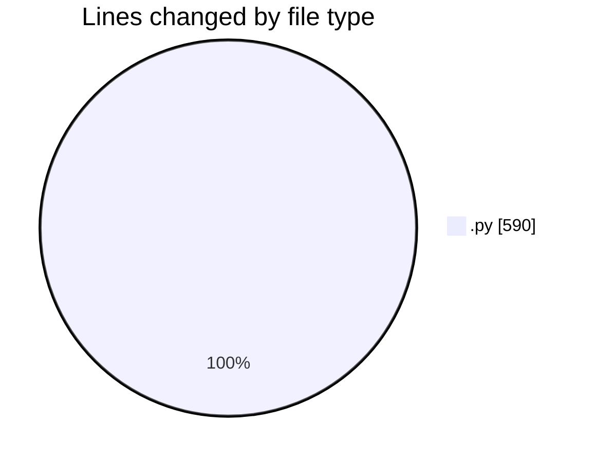
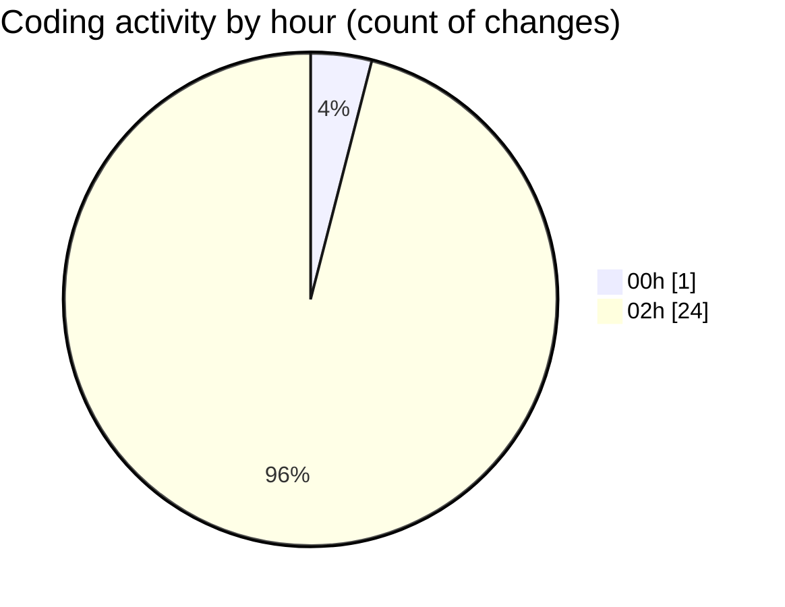

# eventscop-api-guide (Workspace) - Activity Summary 

## Overall Statistics

| Stat                   | Value                                                             |
| ---------------------- | ----------------------------------------------------------------- |
| **Lines Added** (➕)   | 411                                          |
| **Lines Removed** (➖) | 179                                        |
| **Net Change** (↕)    | 232                |
| **Active Time** (⌚)   | 34 minutes |

## Modified Files
- **8ab850fa405b_add_params_table.py** (+234, -0)
- **routes.py** (+5, -7)
- **9e55e953cd63_test.py** (+143, -143)
- **routes.py** (+2, -2)
- **Plateform.py** (+8, -8)
- **activity_search_engine.py** (+2, -2)
- **__init__.py** (+1, -1)
- **routes.py** (+3, -3)
- **env.py** (+13, -13)

## Visualizations

### By File Type (Lines Changed)

### By Hour (Estimated Activity Count)

> **Last Updated:** 11/23/2025, 2:23:43 AM