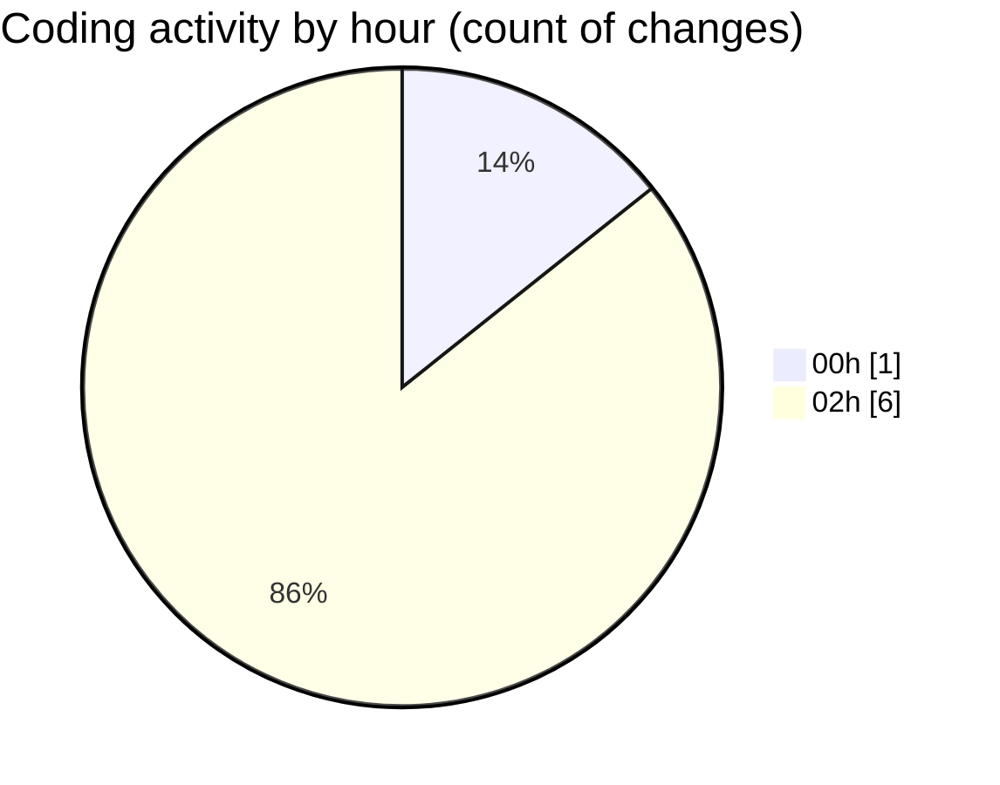

# eventscop-api-guide (Workspace) - Activity Summary 

## Overall Statistics

| Stat                   | Value                                                             |
| ---------------------- | ----------------------------------------------------------------- |
| **Lines Added** (➕)   | 79                                          |
| **Lines Removed** (➖) | 6                                        |
| **Net Change** (↕)    | 73                |
| **Active Time** (⌚)   | 9 minutes |

## Modified Files
- **8ab850fa405b_add_params_table.py** (+75, -0)
- **routes.py** (+4, -6)

## Visualizations

### By File Type (Lines Changed)

### By Hour (Estimated Activity Count)

> **Last Updated:** 11/23/2025, 2:13:41 AM