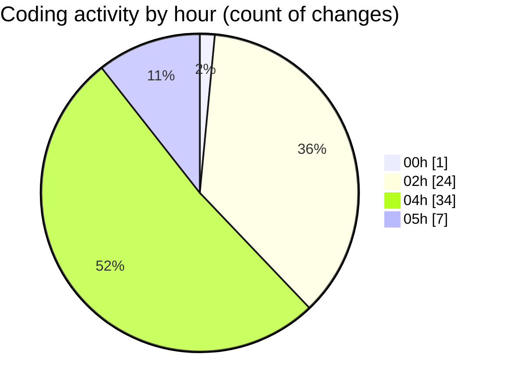

# eventscop-api-guide (Workspace) - Activity Summary 

## Overall Statistics

| Stat                   | Value                                                             |
| ---------------------- | ----------------------------------------------------------------- |
| **Lines Added** (➕)   | 809                                          |
| **Lines Removed** (➖) | 576                                        |
| **Net Change** (↕)    | 233                |
| **Active Time** (⌚)   | 76 minutes |

## Modified Files
- **8ab850fa405b_add_params_table.py** (+234, -0)
- **routes.py** (+23, -25)
- **9e55e953cd63_test.py** (+160, -160)
- **routes.py** (+6, -6)
- **Plateform.py** (+24, -24)
- **activity_search_engine.py** (+160, -160)
- **__init__.py** (+9, -9)
- **routes.py** (+38, -38)
- **env.py** (+35, -34)
- **routes.py** (+90, -90)
- **SupplierActivity.py** (+30, -30)

## Visualizations

### By File Type (Lines Changed)

### By Hour (Estimated Activity Count)

> **Last Updated:** 11/23/2025, 5:08:44 AM