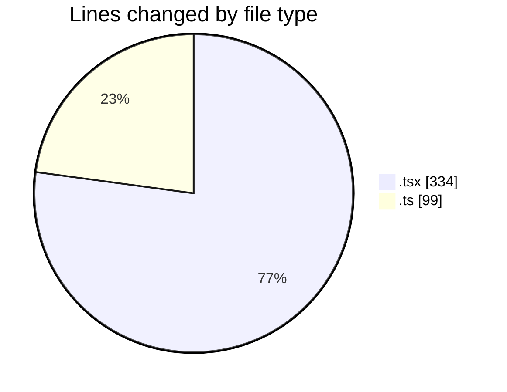
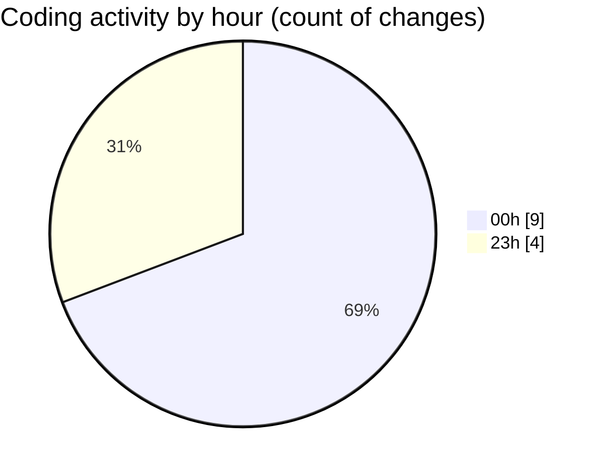

# eventscop-frontend-guide (Workspace) - Activity Summary 

## Overall Statistics

| Stat                   | Value                                                             |
| ---------------------- | ----------------------------------------------------------------- |
| **Lines Added** (➕)   | 424                                          |
| **Lines Removed** (➖) | 9                                        |
| **Net Change** (↕)    | 415                |
| **Active Time** (⌚)   | 25 minutes |

## Modified Files
- **StepContact.tsx** (+8, -0)
- **usePlaceQuoteForm.ts** (+0, -2)
- **NoDatesWarning.tsx** (+49, -3)
- **useDateChangeReset.ts** (+93, -4)
- **StepDates.tsx** (+181, -0)
- **BriefStepWrap.tsx** (+93, -0)

## Visualizations

### By File Type (Lines Changed)

### By Hour (Estimated Activity Count)

> **Last Updated:** 11/23/2025, 12:27:31 AM