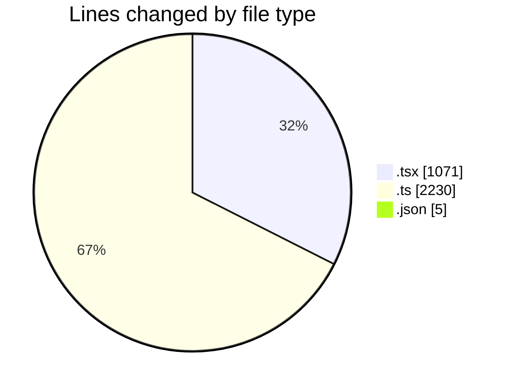
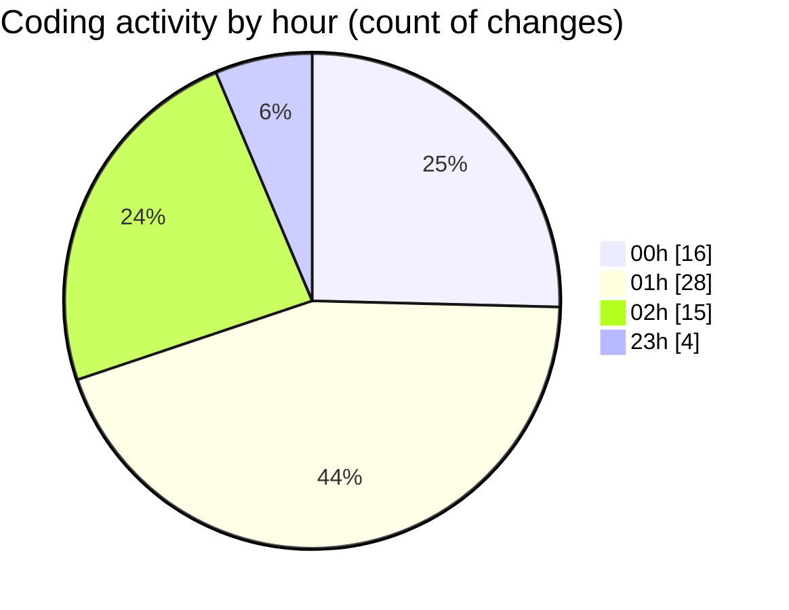

# eventscop-frontend-guide (Workspace) - Activity Summary 

## Overall Statistics

| Stat                   | Value                                                             |
| ---------------------- | ----------------------------------------------------------------- |
| **Lines Added** (➕)   | 3121                                          |
| **Lines Removed** (➖) | 185                                        |
| **Net Change** (↕)    | 2936                |
| **Active Time** (⌚)   | 82 minutes |

## Modified Files
- **StepContact.tsx** (+8, -0)
- **usePlaceQuoteForm.ts** (+0, -81)
- **NoDatesWarning.tsx** (+49, -3)
- **useDateChangeReset.ts** (+93, -4)
- **StepDates.tsx** (+194, -43)
- **BriefStepWrap.tsx** (+99, -12)
- **dateRangeSchema.ts** (+46, -0)
- **BriefAtom.ts** (+305, -0)
- **BriefSummaryItems.tsx** (+166, -6)
- **brief-summary.ts** (+124, -0)
- **SummaryDates.tsx** (+48, -0)
- **fr.json** (+5, -0)
- **BudgetSchema.ts** (+33, -5)
- **StepBudget.tsx** (+84, -0)
- **SummaryBudget.tsx** (+30, -0)
- **useBudgetForm.tsx** (+97, -0)
- **utils.ts** (+49, -0)
- **brief.ts** (+807, -0)
- **StepAccommodationDetails.tsx** (+150, -0)
- **useMeetingHallForm.ts** (+148, -0)
- **sitemap-generator.ts** (+365, -9)
- **route.ts** (+114, -0)
- **route.ts** (+33, -0)
- **plateform.ts** (+0, -14)
- **PlaceQuoteForm.tsx** (+74, -0)
- **DatesModal.tsx** (+0, -8)

## Visualizations

### By File Type (Lines Changed)

### By Hour (Estimated Activity Count)

> **Last Updated:** 11/23/2025, 2:52:33 AM