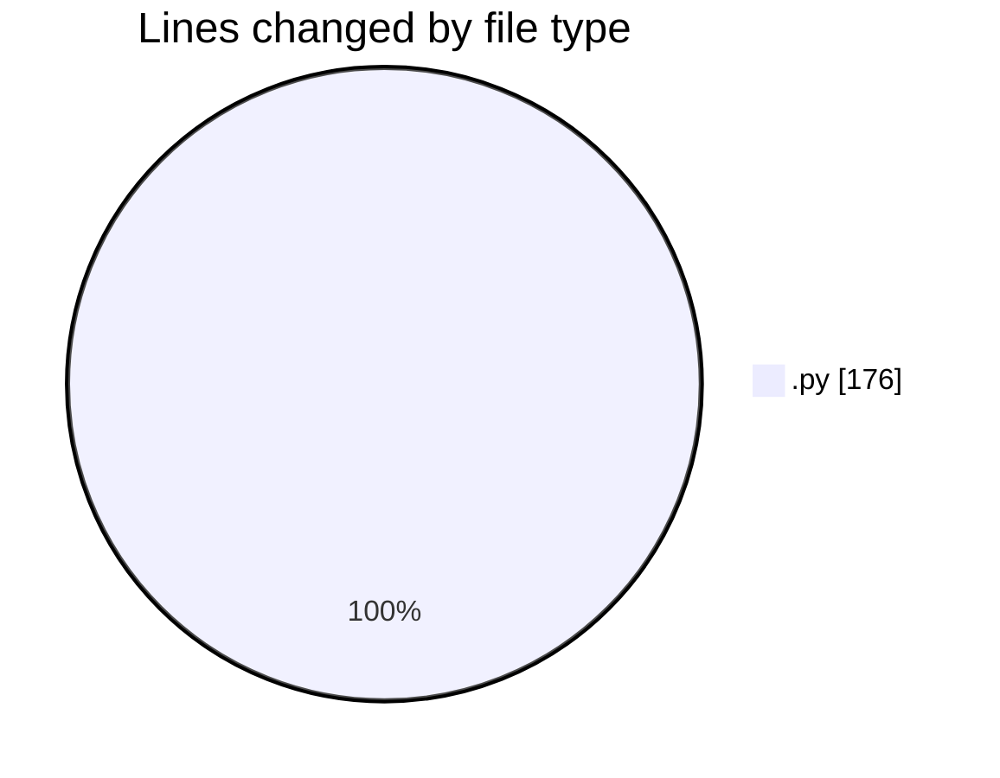
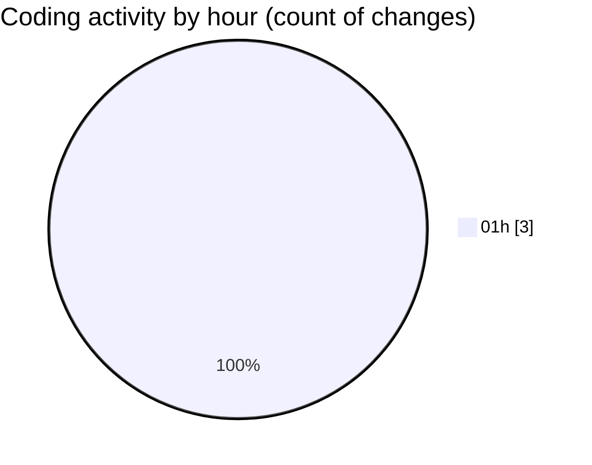

# eventscop-api-guide (Workspace) - Activity Summary 

## Overall Statistics

| Stat                   | Value                                                             |
| ---------------------- | ----------------------------------------------------------------- |
| **Lines Added** (➕)   | 176                                          |
| **Lines Removed** (➖) | 0                                        |
| **Net Change** (↕)    | 176                |
| **Active Time** (⌚)   | 1 minute |

## Modified Files
- **routes.py** (+2, -0)
- **00a096886d9d_add_trans.py** (+174, -0)

## Visualizations

### By File Type (Lines Changed)

### By Hour (Estimated Activity Count)

> **Last Updated:** 11/24/2025, 1:18:46 AM