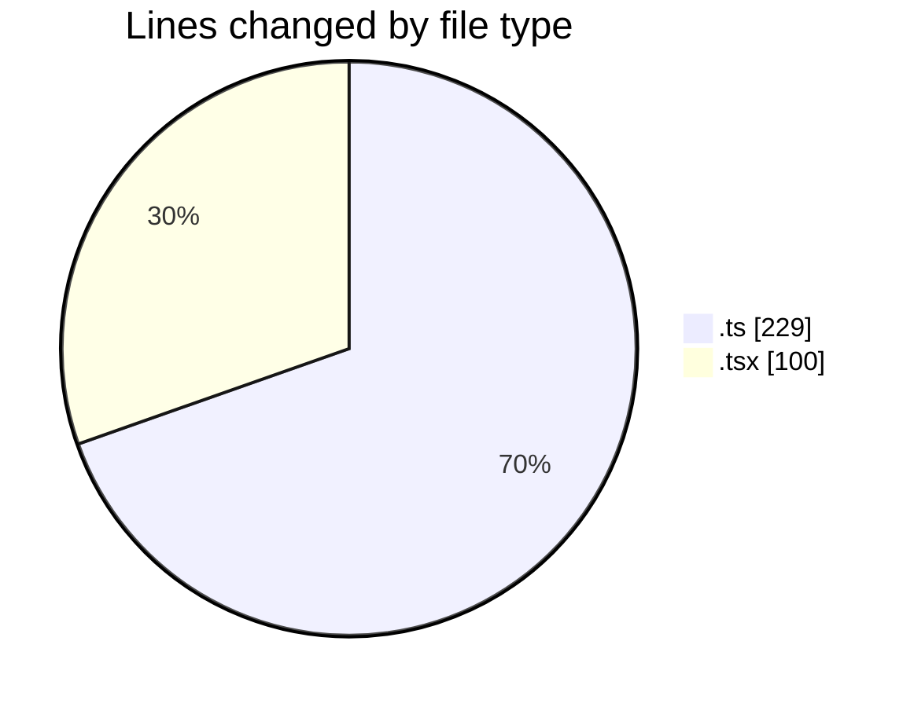
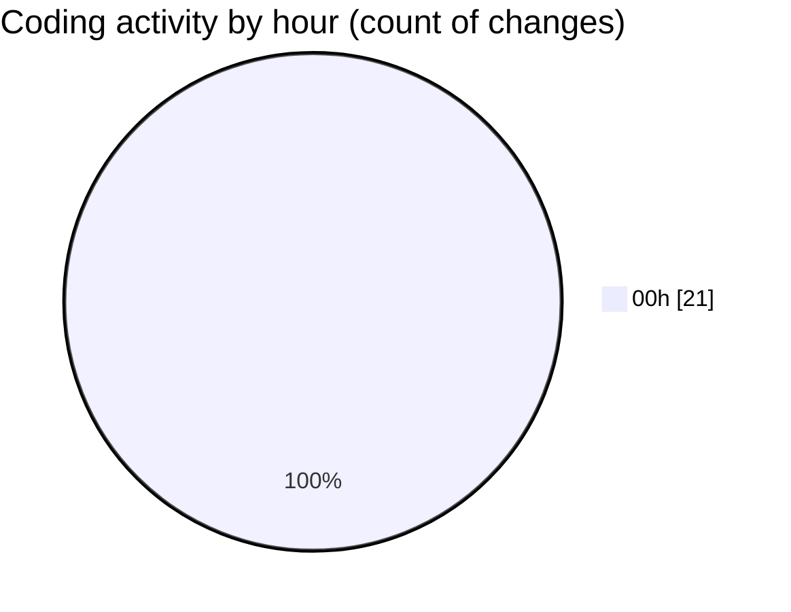

# eventscop-frontend-guide (Workspace) - Activity Summary 

## Overall Statistics

| Stat                   | Value                                                             |
| ---------------------- | ----------------------------------------------------------------- |
| **Lines Added** (➕)   | 170                                          |
| **Lines Removed** (➖) | 159                                        |
| **Net Change** (↕)    | 11                |
| **Active Time** (⌚)   | 24 minutes |

## Modified Files
- **brief.ts** (+2, -1)
- **BriefAtom.ts** (+16, -0)
- **StepContact.tsx** (+31, -18)
- **ComparisonRenderers.tsx** (+48, -0)
- **usePlaceQuoteForm.ts** (+70, -140)
- **NoDatesWarning.tsx** (+3, -0)

## Visualizations

### By File Type (Lines Changed)

### By Hour (Estimated Activity Count)

> **Last Updated:** 11/24/2025, 12:52:35 AM