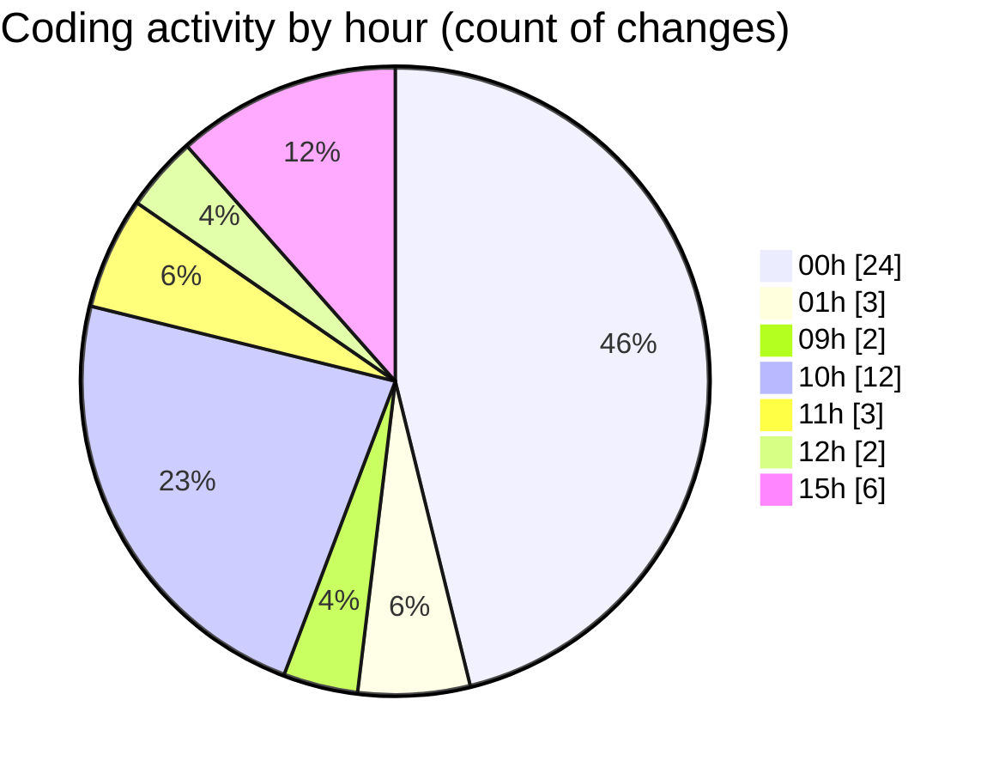

# eventscop-frontend-guide (Workspace) - Activity Summary 

## Overall Statistics

| Stat                   | Value                                                             |
| ---------------------- | ----------------------------------------------------------------- |
| **Lines Added** (➕)   | 694                                          |
| **Lines Removed** (➖) | 218                                        |
| **Net Change** (↕)    | 476                |
| **Active Time** (⌚)   | 59 minutes |

## Modified Files
- **brief.ts** (+2, -1)
- **BriefAtom.ts** (+16, -0)
- **StepContact.tsx** (+32, -18)
- **ComparisonRenderers.tsx** (+48, -0)
- **usePlaceQuoteForm.ts** (+70, -140)
- **NoDatesWarning.tsx** (+3, -0)
- **forms.ts** (+74, -0)
- **fr.json** (+53, -6)
- **ConfirmationModal.tsx** (+112, -26)
- **BriefSection.tsx** (+59, -2)
- **page.tsx** (+14, -14)
- **WelcomeSelectSteps.tsx** (+21, -11)
- **useOrganizeNavigation.ts** (+23, -0)
- **navigation.ts** (+167, -0)

## Visualizations

### By File Type (Lines Changed)

### By Hour (Estimated Activity Count)

> **Last Updated:** 11/24/2025, 3:37:38 PM