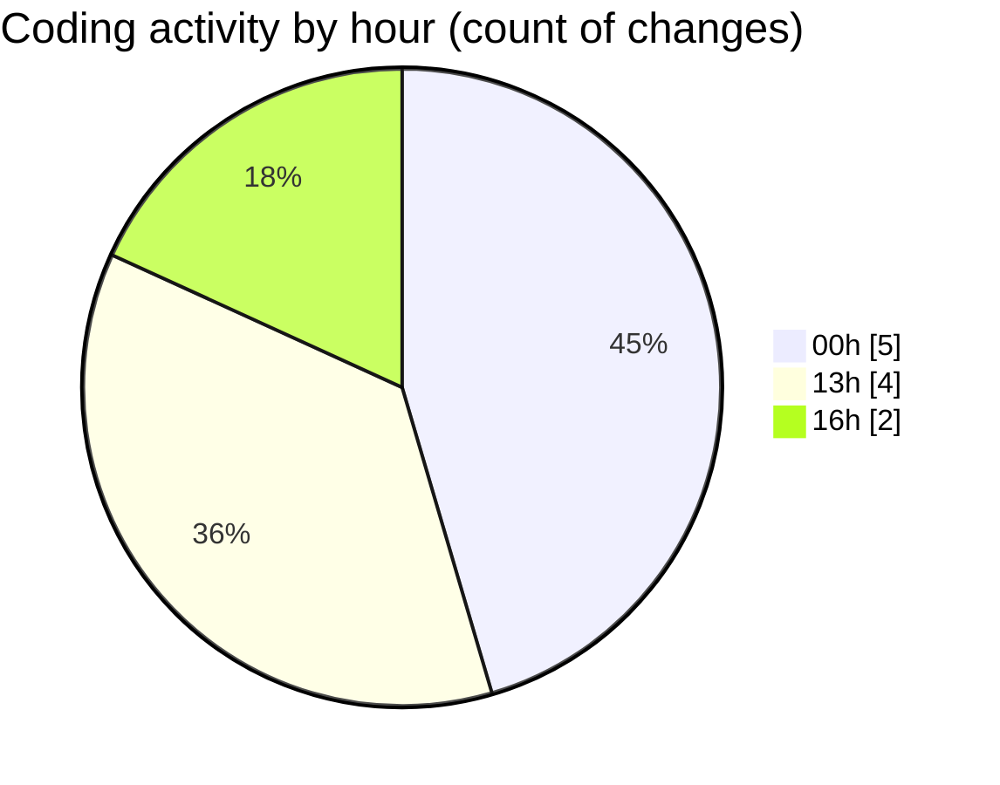

# eventscop-api-guide (Workspace) - Activity Summary 

## Overall Statistics

| Stat                   | Value                                                             |
| ---------------------- | ----------------------------------------------------------------- |
| **Lines Added** (➕)   | 2451                                          |
| **Lines Removed** (➖) | 113                                        |
| **Net Change** (↕)    | 2338                |
| **Active Time** (⌚)   | 10 minutes |

## Modified Files
- **SupplierRseLabel.py** (+55, -0)
- **052ff740ad34_add_missing_indexes_for_search_.py** (+158, -112)
- **routes.py** (+905, -0)
- **routes.py** (+725, -0)
- **routes.py** (+608, -1)

## Visualizations

### By File Type (Lines Changed)

### By Hour (Estimated Activity Count)

> **Last Updated:** 11/25/2025, 4:23:50 PM