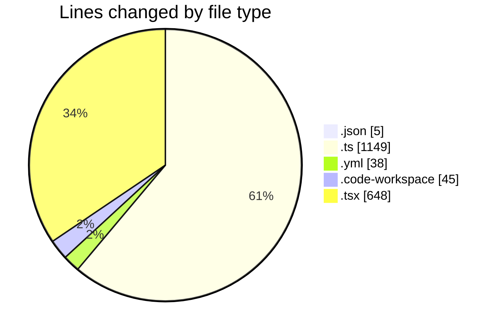
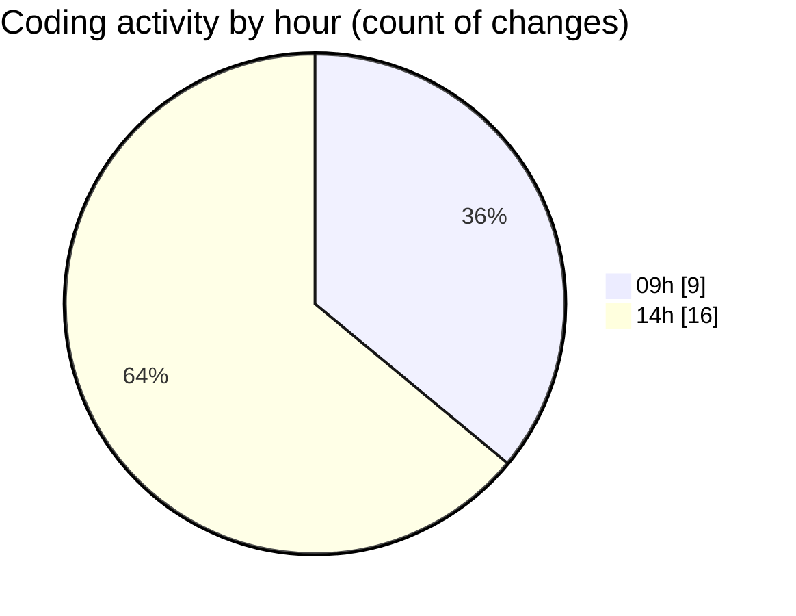

# eventscop-frontend-guide (Workspace) - Activity Summary 

## Overall Statistics

| Stat                   | Value                                                             |
| ---------------------- | ----------------------------------------------------------------- |
| **Lines Added** (➕)   | 1874                                          |
| **Lines Removed** (➖) | 11                                        |
| **Net Change** (↕)    | 1863                |
| **Active Time** (⌚)   | 40 minutes |

## Modified Files
- **package.json** (+3, -2)
- **route.ts** (+74, -1)
- **lefthook.yml** (+30, -8)
- **eventscop-frontend-guide.code-workspace** (+45, -0)
- **validator.ts** (+737, -0)
- **CityAutocomplete.tsx** (+261, -0)
- **ActivityQuoteForm.tsx** (+162, -0)
- **page.tsx** (+150, -0)
- **ActivityQuoteSidebar.tsx** (+31, -0)
- **common.ts** (+285, -0)
- **QuoteTarifs.tsx** (+44, -0)
- **product.ts** (+52, -0)

## Visualizations

### By File Type (Lines Changed)

### By Hour (Estimated Activity Count)

> **Last Updated:** 11/25/2025, 2:50:49 PM