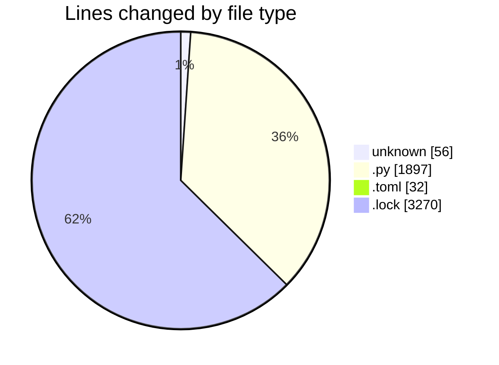
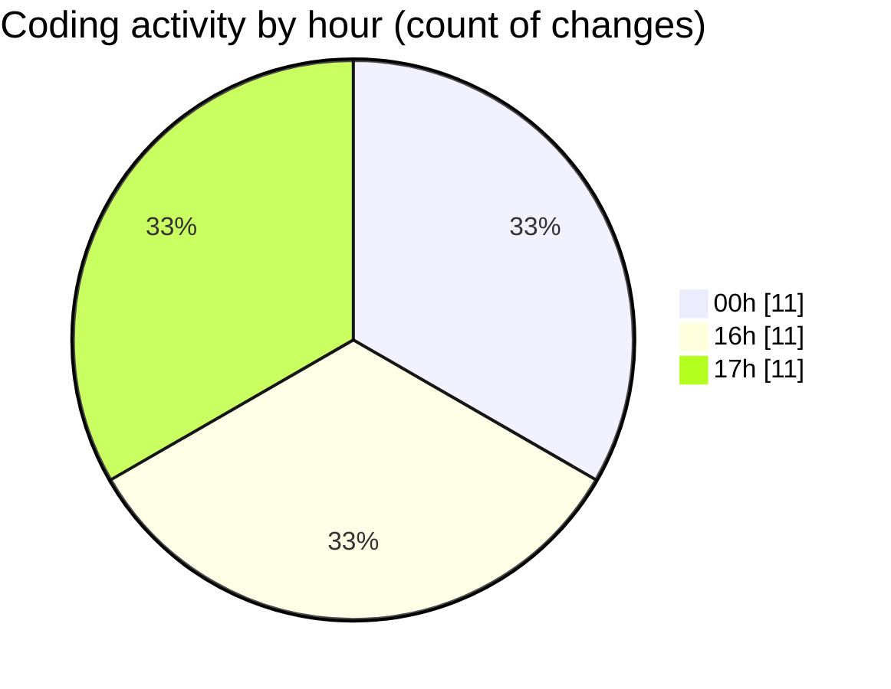

# eventscop-api-guide (Workspace) - Activity Summary 

## Overall Statistics

| Stat                   | Value                                                             |
| ---------------------- | ----------------------------------------------------------------- |
| **Lines Added** (➕)   | 5158                                          |
| **Lines Removed** (➖) | 97                                        |
| **Net Change** (↕)    | 5061                |
| **Active Time** (⌚)   | 36 minutes |

## Modified Files
- **.env** (+56, -0)
- **main.py** (+226, -37)
- **routes.py** (+606, -0)
- **routes.py** (+394, -56)
- **routes.py** (+297, -0)
- **service.py** (+277, -4)
- **pyproject.toml** (+32, -0)
- **poetry.lock** (+3270, -0)

## Visualizations

### By File Type (Lines Changed)

### By Hour (Estimated Activity Count)

> **Last Updated:** 11/26/2025, 5:40:41 PM