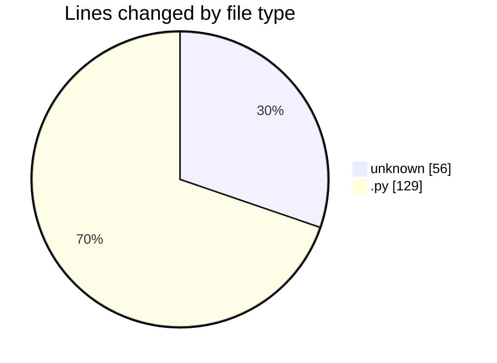
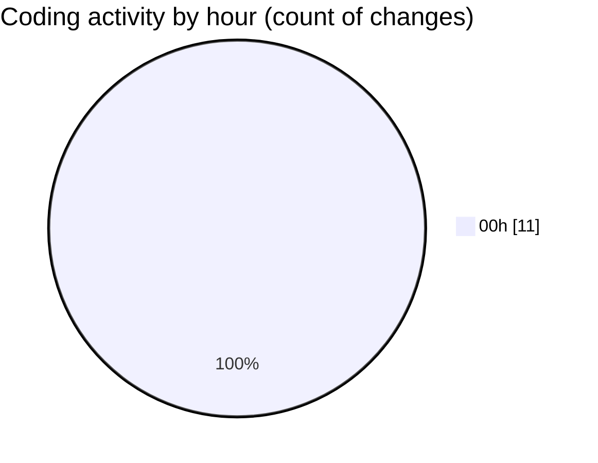

# eventscop-api-guide (Workspace) - Activity Summary 

## Overall Statistics

| Stat                   | Value                                                             |
| ---------------------- | ----------------------------------------------------------------- |
| **Lines Added** (➕)   | 171                                          |
| **Lines Removed** (➖) | 14                                        |
| **Net Change** (↕)    | 157                |
| **Active Time** (⌚)   | 13 minutes |

## Modified Files
- **.env** (+56, -0)
- **main.py** (+115, -14)

## Visualizations

### By File Type (Lines Changed)

### By Hour (Estimated Activity Count)

> **Last Updated:** 11/26/2025, 12:33:50 AM