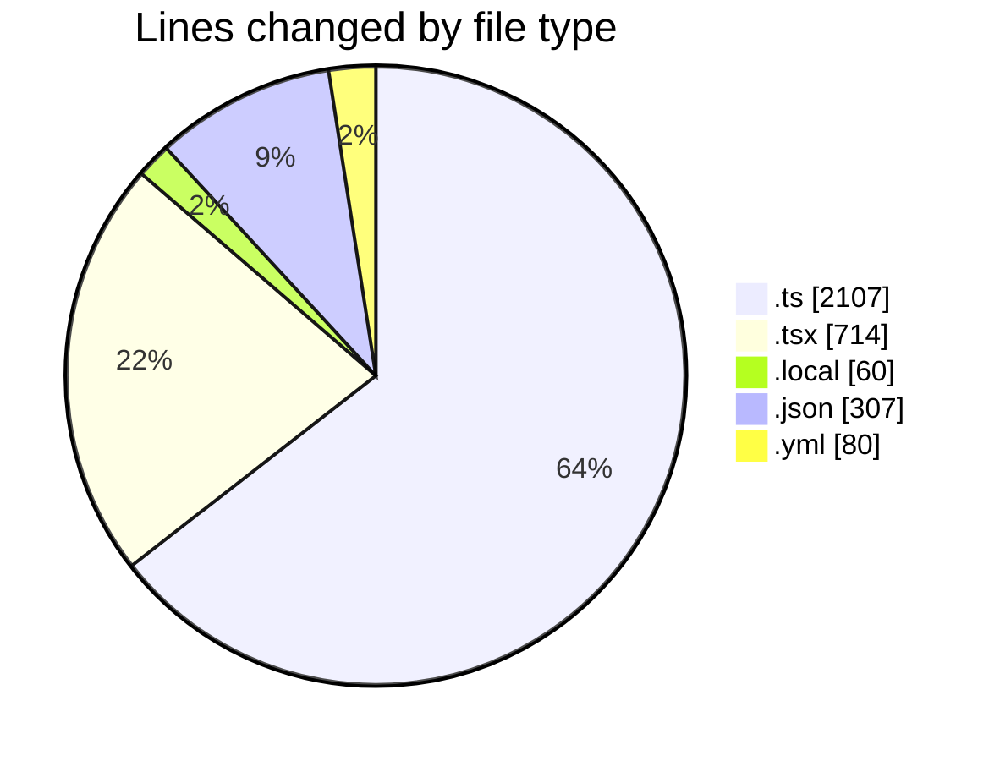
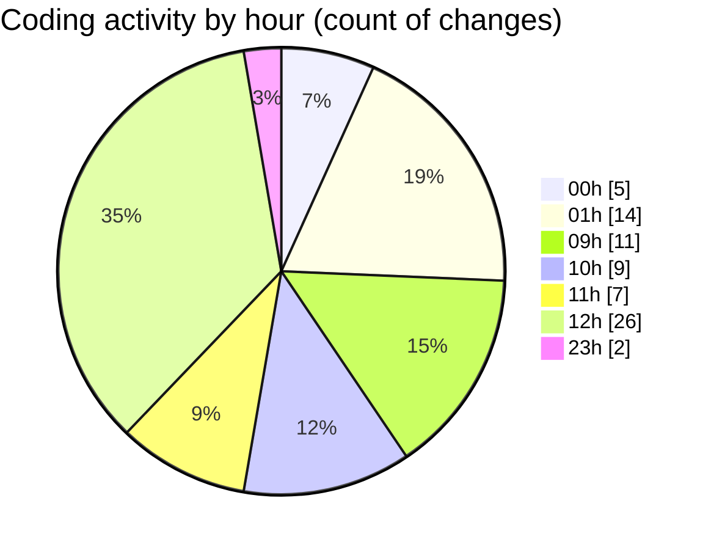

# eventscop-frontend-guide (Workspace) - Activity Summary 

## Overall Statistics

| Stat                   | Value                                                             |
| ---------------------- | ----------------------------------------------------------------- |
| **Lines Added** (➕)   | 2945                                          |
| **Lines Removed** (➖) | 323                                        |
| **Net Change** (↕)    | 2622                |
| **Active Time** (⌚)   | 125 minutes |

## Modified Files
- **supplier-activities.ts** (+661, -142)
- **page.tsx** (+220, -42)
- **supplier-activity.ts** (+43, -1)
- **redirects.ts** (+113, -7)
- **middleware.ts** (+367, -0)
- **.env.local** (+59, -1)
- **settings.json** (+307, -0)
- **supplier-activity.ts** (+371, -9)
- **suppliers.ts** (+284, -13)
- **lefthook.yml** (+51, -29)
- **ConfirmationModal.tsx** (+112, -43)
- **WelcomeSelectSteps.tsx** (+142, -10)
- **FinalRecap.tsx** (+43, -0)
- **forms.ts** (+89, -7)
- **RecapConfirmation.tsx** (+83, -19)

## Visualizations

### By File Type (Lines Changed)

### By Hour (Estimated Activity Count)

> **Last Updated:** 11/26/2025, 12:48:51 PM