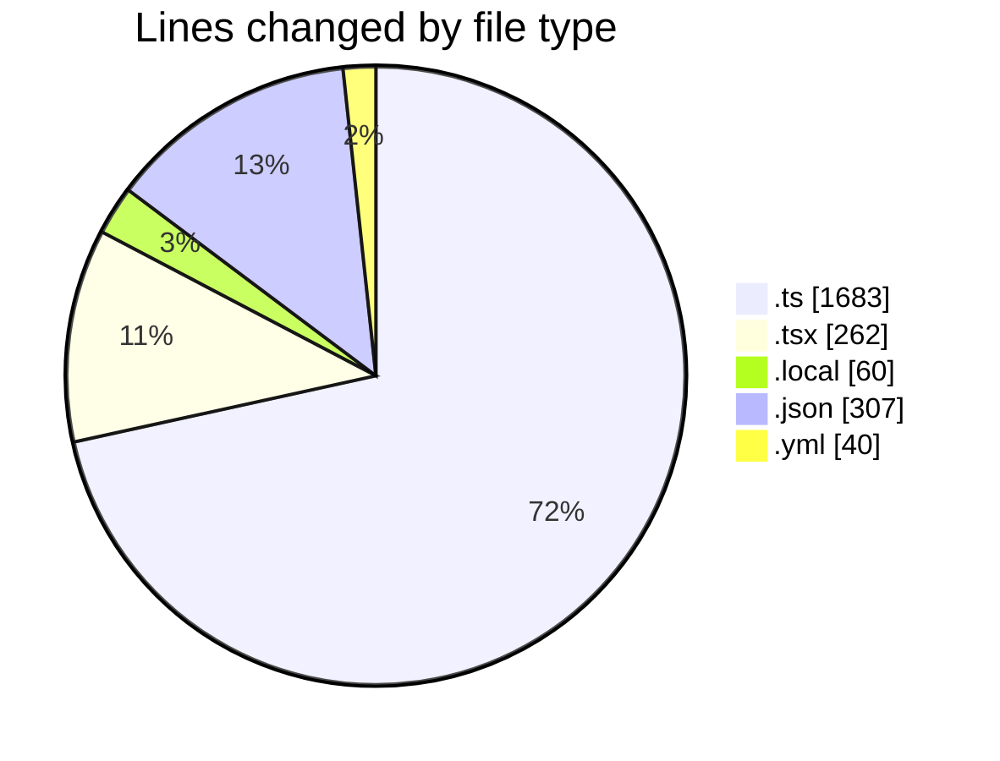
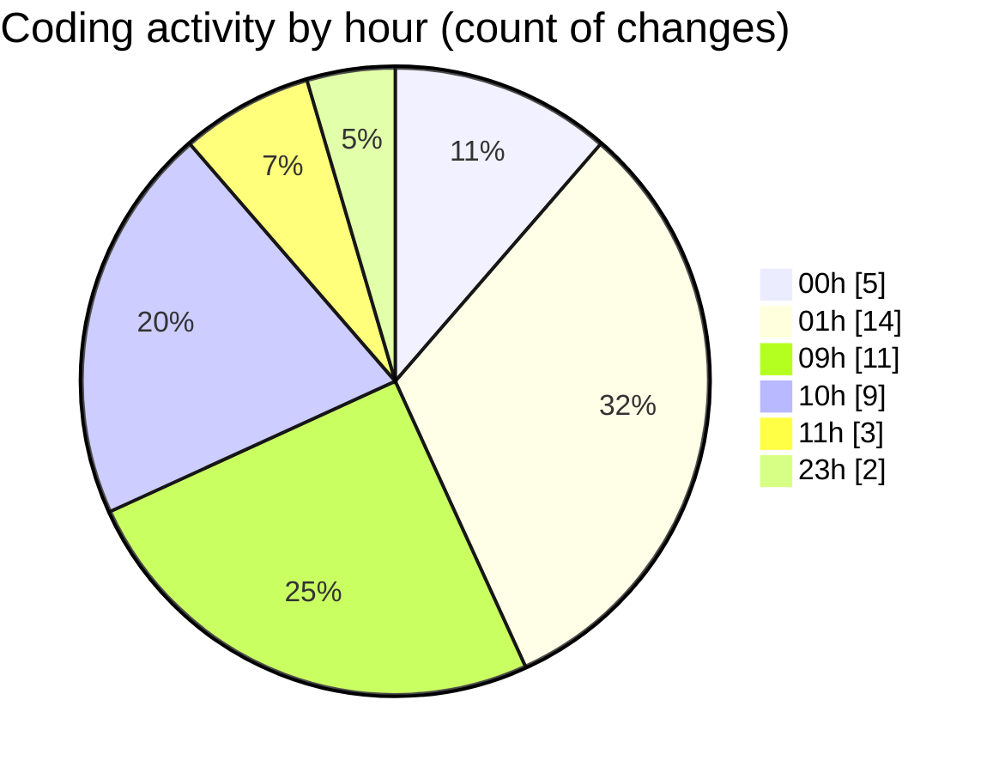

# eventscop-frontend-guide (Workspace) - Activity Summary 

## Overall Statistics

| Stat                   | Value                                                             |
| ---------------------- | ----------------------------------------------------------------- |
| **Lines Added** (➕)   | 2258                                          |
| **Lines Removed** (➖) | 94                                        |
| **Net Change** (↕)    | 2164                |
| **Active Time** (⌚)   | 71 minutes |

## Modified Files
- **supplier-activities.ts** (+661, -25)
- **page.tsx** (+220, -42)
- **supplier-activity.ts** (+43, -1)
- **redirects.ts** (+113, -7)
- **middleware.ts** (+178, -0)
- **.env.local** (+59, -1)
- **settings.json** (+307, -0)
- **supplier-activity.ts** (+362, -9)
- **suppliers.ts** (+284, -0)
- **lefthook.yml** (+31, -9)

## Visualizations

### By File Type (Lines Changed)

### By Hour (Estimated Activity Count)

> **Last Updated:** 11/26/2025, 11:43:51 AM