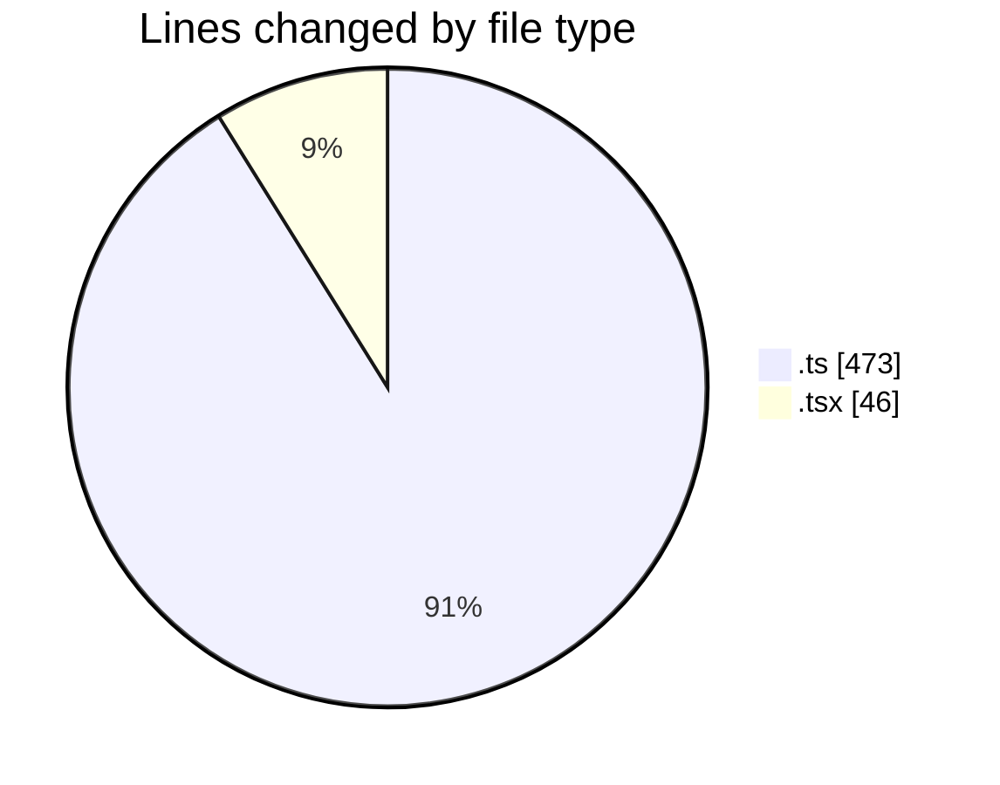

# eventscop-frontend-guide (Workspace) - Activity Summary 

## Overall Statistics

| Stat                   | Value                                                             |
| ---------------------- | ----------------------------------------------------------------- |
| **Lines Added** (➕)   | 486                                          |
| **Lines Removed** (➖) | 33                                        |
| **Net Change** (↕)    | 453                |
| **Active Time** (⌚)   | 30 minutes |

## Modified Files
- **supplier-activities.ts** (+152, -0)
- **page.tsx** (+21, -25)
- **supplier-activity.ts** (+22, -1)
- **redirects.ts** (+113, -7)
- **middleware.ts** (+178, -0)

## Visualizations

### By File Type (Lines Changed)

### By Hour (Estimated Activity Count)

> **Last Updated:** 11/26/2025, 1:40:50 AM