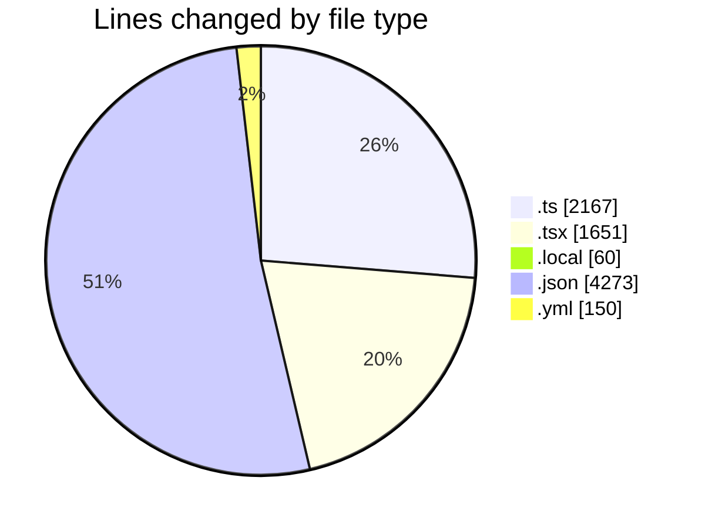
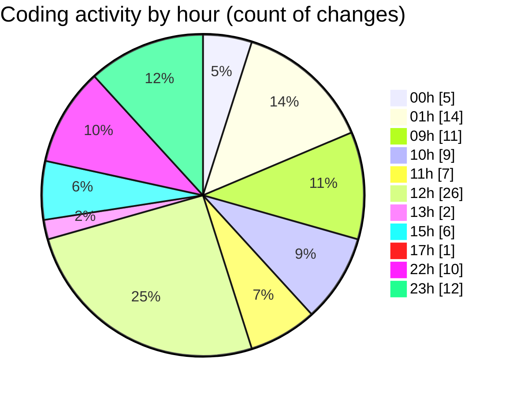

# eventscop-frontend-guide (Workspace) - Activity Summary 

## Overall Statistics

| Stat                   | Value                                                             |
| ---------------------- | ----------------------------------------------------------------- |
| **Lines Added** (➕)   | 7921                                          |
| **Lines Removed** (➖) | 380                                        |
| **Net Change** (↕)    | 7541                |
| **Active Time** (⌚)   | 148 minutes |

## Modified Files
- **supplier-activities.ts** (+661, -142)
- **page.tsx** (+220, -42)
- **supplier-activity.ts** (+43, -1)
- **redirects.ts** (+113, -7)
- **middleware.ts** (+367, -0)
- **.env.local** (+59, -1)
- **settings.json** (+307, -0)
- **supplier-activity.ts** (+371, -9)
- **suppliers.ts** (+284, -13)
- **lefthook.yml** (+92, -58)
- **ConfirmationModal.tsx** (+131, -43)
- **WelcomeSelectSteps.tsx** (+142, -10)
- **FinalRecap.tsx** (+48, -0)
- **forms.ts** (+89, -14)
- **RecapConfirmation.tsx** (+102, -19)
- **ClientPresearchSection.tsx** (+336, -10)
- **ActivityQuoteForm.tsx** (+381, -6)
- **fr.json** (+3964, -2)
- **RadiusSelector.tsx** (+158, -3)
- **useActivityQuoteForm.ts** (+53, -0)

## Visualizations

### By File Type (Lines Changed)

### By Hour (Estimated Activity Count)

> **Last Updated:** 11/26/2025, 11:35:24 PM