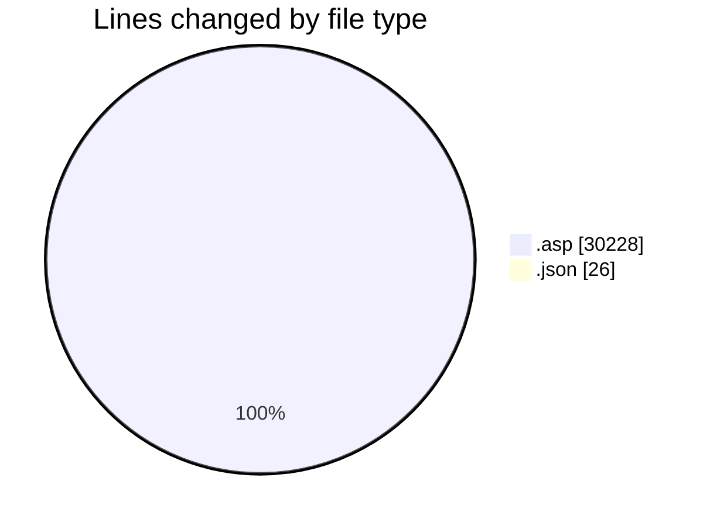
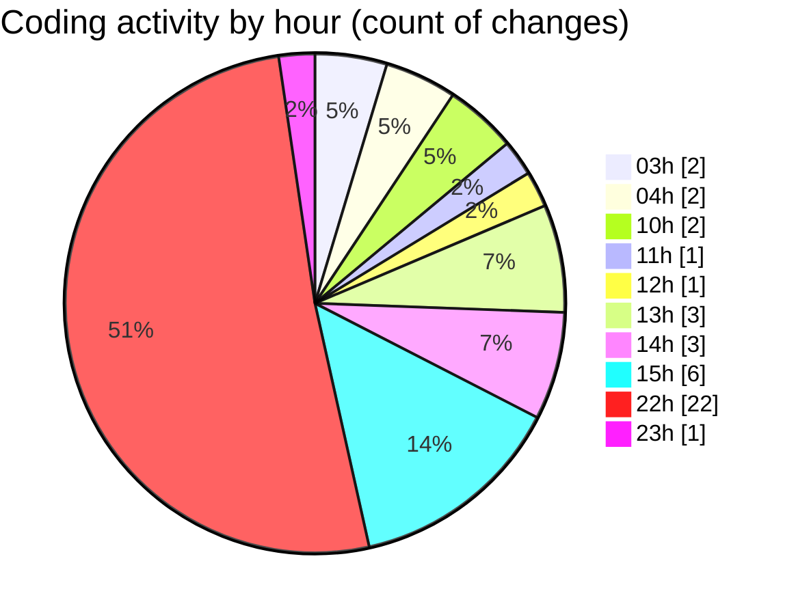

# cdp.aleoudev.fr (Workspace) - Activity Summary 

## Overall Statistics

| Stat                   | Value                                                             |
| ---------------------- | ----------------------------------------------------------------- |
| **Lines Added** (➕)   | 30242                                          |
| **Lines Removed** (➖) | 12                                        |
| **Net Change** (↕)    | 30230                |
| **Active Time** (⌚)   | 31 minutes |

## Modified Files
- **demande_step_0.asp** (+3075, -4)
- **functions.asp** (+16, -3)
- **outils.asp** (+4030, -0)
- **demande_step_5_tab_presta.asp** (+1711, -0)
- **entry.asp** (+205, -0)
- **dashboard.asp** (+2, -0)
- **demande_step_0_view.asp** (+3, -0)
- **demande_action_db.asp** (+2015, -1)
- **client_form.asp** (+1718, -0)
- **settings.json** (+22, -4)
- **seminar_service.asp** (+724, -0)
- **excel.asp** (+650, -0)
- **ajax_seminaires_tab.asp** (+946, -0)
- **action_form.asp** (+638, -0)
- **action_search.asp** (+884, -0)
- **societe_form.asp** (+1759, -0)
- **stats_seminaire.asp** (+2664, -0)
- **type_seminaire_form.asp** (+90, -0)
- **search.asp** (+1495, -0)
- **demande_form.asp** (+1189, -0)
- **demande_search.asp** (+2039, -0)
- **demande_attribution.asp** (+1722, -0)
- **fx_query.asp** (+2137, -0)
- **stats_globale.asp** (+218, -0)
- **type_seminaire_search.asp** (+290, -0)

## Visualizations

### By File Type (Lines Changed)

### By Hour (Estimated Activity Count)

> **Last Updated:** 11/27/2025, 11:11:40 PM