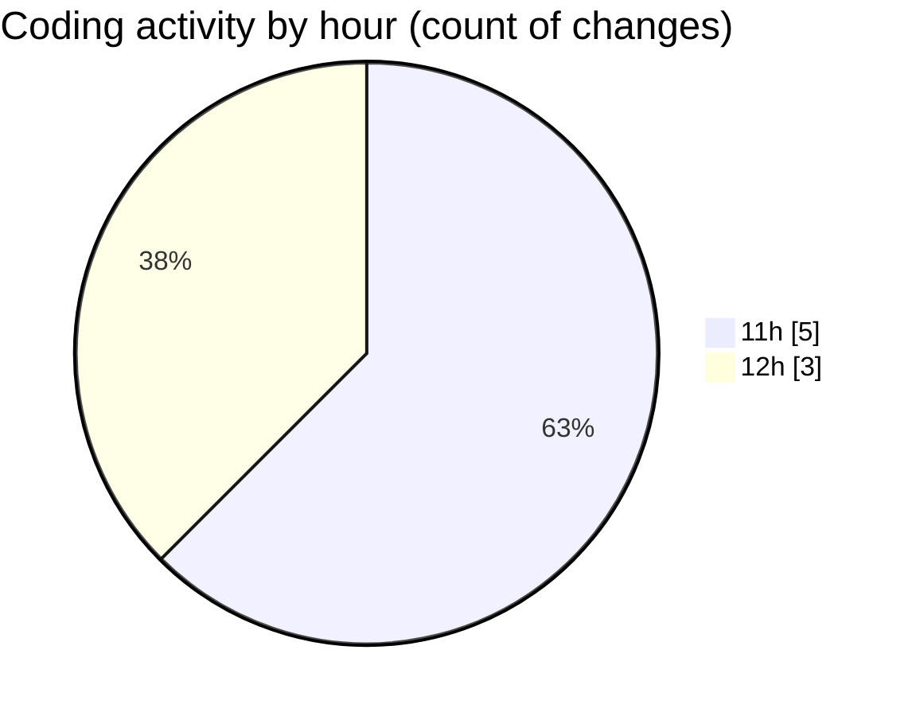

# eventscop-api-guide (Workspace) - Activity Summary 

## Overall Statistics

| Stat                   | Value                                                             |
| ---------------------- | ----------------------------------------------------------------- |
| **Lines Added** (➕)   | 937                                          |
| **Lines Removed** (➖) | 2                                        |
| **Net Change** (↕)    | 935                |
| **Active Time** (⌚)   | 18 minutes |

## Modified Files
- **search_engine.py** (+937, -2)

## Visualizations

### By File Type (Lines Changed)

### By Hour (Estimated Activity Count)

> **Last Updated:** 11/27/2025, 12:05:47 PM