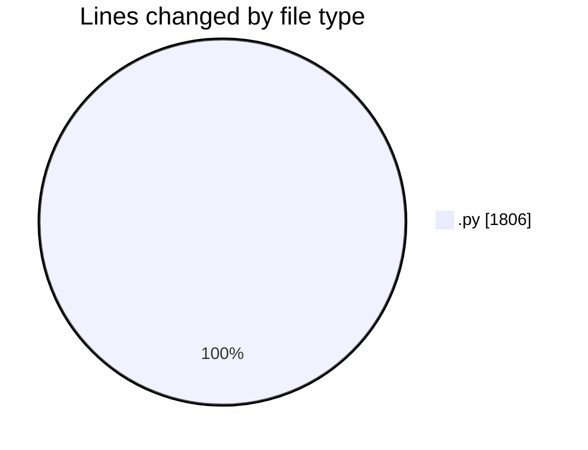
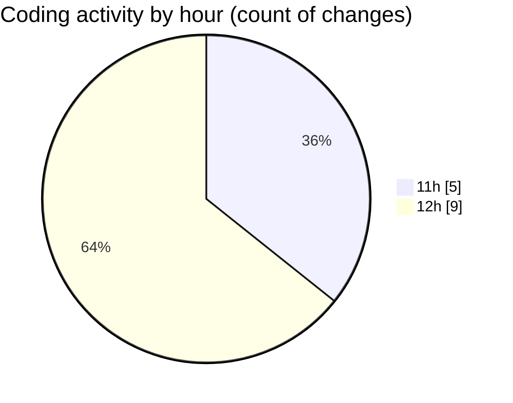

# eventscop-api-guide (Workspace) - Activity Summary 

## Overall Statistics

| Stat                   | Value                                                             |
| ---------------------- | ----------------------------------------------------------------- |
| **Lines Added** (➕)   | 1793                                          |
| **Lines Removed** (➖) | 13                                        |
| **Net Change** (↕)    | 1780                |
| **Active Time** (⌚)   | 26 minutes |

## Modified Files
- **search_engine.py** (+950, -13)
- **routes.py** (+727, -0)
- **background_tasks.py** (+116, -0)

## Visualizations

### By File Type (Lines Changed)

### By Hour (Estimated Activity Count)

> **Last Updated:** 11/27/2025, 12:35:47 PM