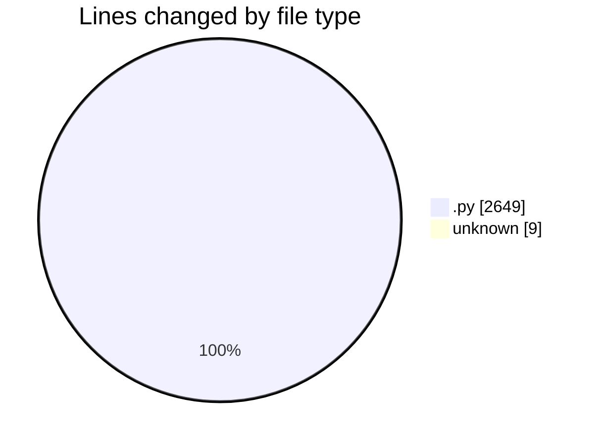
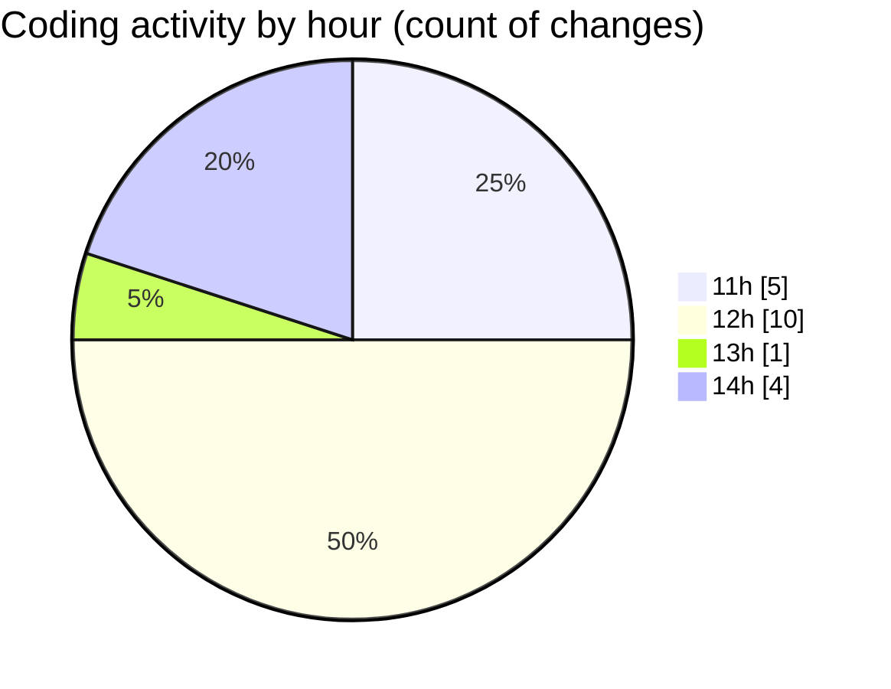

# eventscop-api-guide (Workspace) - Activity Summary 

## Overall Statistics

| Stat                   | Value                                                             |
| ---------------------- | ----------------------------------------------------------------- |
| **Lines Added** (➕)   | 2643                                          |
| **Lines Removed** (➖) | 15                                        |
| **Net Change** (↕)    | 2628                |
| **Active Time** (⌚)   | 33 minutes |

## Modified Files
- **search_engine.py** (+950, -15)
- **routes.py** (+727, -0)
- **background_tasks.py** (+120, -0)
- **postgres_objects.py** (+197, -0)
- **activity_search_engine.py** (+640, -0)
- **COMMIT_EDITMSG** (+9, -0)

## Visualizations

### By File Type (Lines Changed)

### By Hour (Estimated Activity Count)

> **Last Updated:** 11/27/2025, 2:25:47 PM